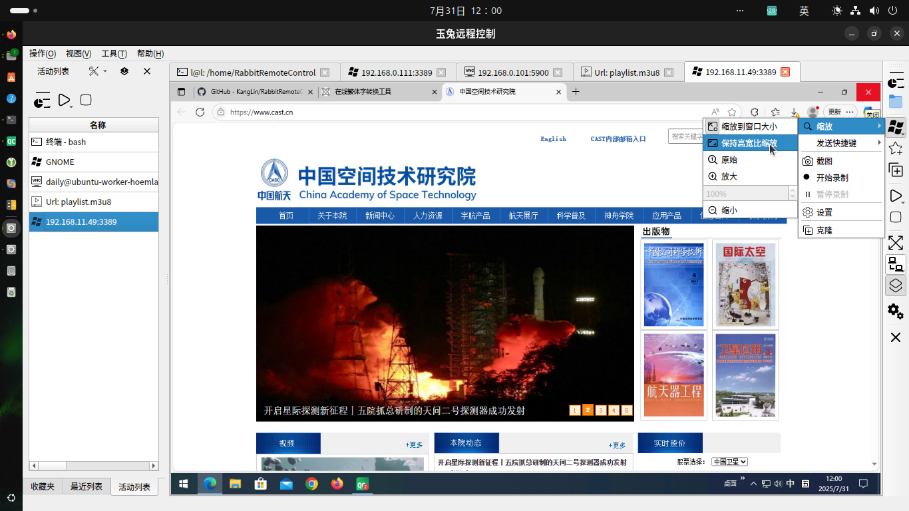
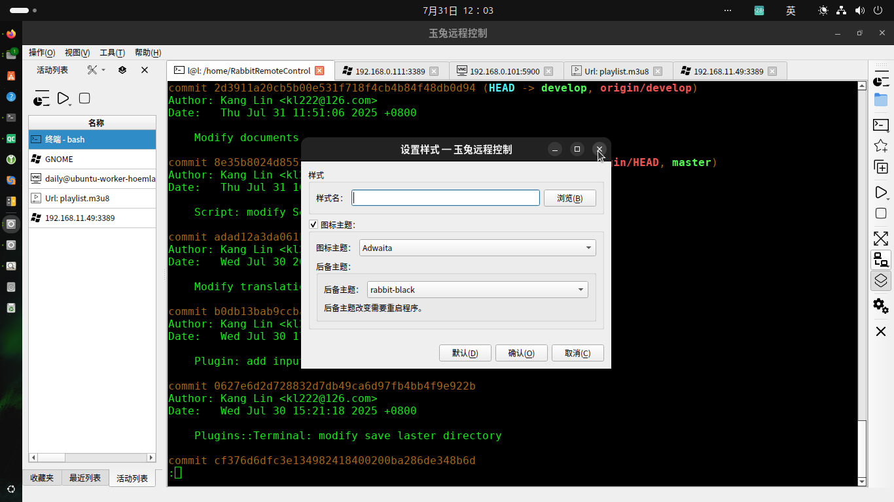

# [Rabbit Remote Control](https://github.com/KangLin/RabbitRemoteControl)

Author: Kang Lin <kl222@126.com>

-----------------------------------------------------------------------

[:cn: 中文](README_zh_CN.md)

-----------------------------------------------------------------------

- [Introduction](#Introduction)
  + [Screenshot](#Screenshot)
    - [Multiple style](#Multiple-style)
  + [Project repository position](#Project-repository-position)
- [Functions](#Functions)
  + [Supported operating system](#Supported-operating-system)
  + [Supported multiple languages](#Supported-multiple-languages)
  + [Supported protocols](#Supported-protocols)
    - [Remote control protocols](#Remote-control-protocols)
    - [Network protocols](#Network-protocols)
  + [Function list](#Function-list)
  + [Plugins](#Plugins)
  + [Full Documentation](#Full-Documentation)
- [Status](#Status)
- [Sponsorship and Donations](#Sponsorship-and-Donations)
- [Contribution](#Contribution)
- [Road map](#Road-map)
- [Download](#Download)
- [Change log](ChangeLog.md)
- [Development](#Development)
  + [Compilation](#Compilation)
    - [Compiling for Linux](docs/Compile/Linux.md)
    - [Compiling for Windows](docs/Compile/Windows.md)
- [License Agreement](#License-Agreement)

-----------------------------------------------------------------------

## Introduction
Rabbit Remote Control is a cross-platform, multi-protocol remote control software.

**Allows you to use any device and system in anywhere and remotely manage any device and system in any way**. 

It include remote desktop, remote terminal etc remote control functions.

### Screenshot

|Main window|Recent list menu|Connect|Work|
|--|--|--|--|
|||||

#### Multiple style

|Default style|Black-Green style|Black style|White style|
|:-------:|:------:|:-------:|:------:|
|||||

### Project repository position

- Main repository: https://github.com/KangLin/RabbitRemoteControl
- Mirror repository:
  - sourceforge: https://sourceforge.net/projects/rabbitremotecontrol/
  - gitlab: https://gitlab.com/kl222/RabbitRemoteControl
  - launchpad: https://launchpad.net/rabbitremotecontrol
  - gitee: https://gitee.com/kl222/RabbitRemoteControl

## Functions

### Supported operating system

See: [https://doc.qt.io/qt-5/supported-platforms.html](https://doc.qt.io/qt-5/supported-platforms.html)

- [x] Windows 7 SP1 and later
- [x] Unix/Linux
- [x] Android
- [ ] mac os
- [ ] IPHONE
- [ ] WINCE

I have no devices so I did not compile and test. Please test by yourself if you have devices.
Interested and capable friends are welcome to participate in the development of the project.

If you want to donate the developed devices for me, please contact: (email: kl222@126.com)

See: [Qt5](https://doc.qt.io/qt-5/supported-platforms.html), [Qt6](https://doc.qt.io/qt-6/supported-platforms.html)

|        |Windows|Unix/linux|Android|MAC|IPHONE|WINCE|
|--------|:-----:|:--------:|:-----:|:-:|:----:|:---:|
|vnc     |✓      |✓         |       |   |      |     |
|RDP     |✓      |✓         |       |   |      |     |
|Spice   |       |          |       |   |      |     |
|Scrcpy  |       |          |       |   |      |     |
|Terminal|       |✓         |       |   |      |     |
|SSH     |       |✓         |       |   |      |     |
|TELNET  |       |✓         |       |   |      |     |
|FTP     |       |          |       |   |      |     |

Legend: ✓ : completed; … : working; ⭕ : not completed; Empty: not started; ❌: not supported

### Supported multiple languages

- [x] English
- [x] Chinese
  - [x] Simplified Chinese
  - [x] Traditional Chinese

### Supported protocols

#### Remote control protocols

- [x] RFB(Remote frame buffer) is also called VNC(Virtual Network Computing): [https://github.com/rfbproto/rfbproto](https://github.com/rfbproto/rfbproto)
- [x] RDP(Remote desktop protocol): [https://github.com/FreeRDP/FreeRDP/wiki/Reference-Documentation](https://github.com/FreeRDP/FreeRDP/wiki/Reference-Documentation)
- [ ] Spice: [https://www.spice-space.org/](https://www.spice-space.org/)
- [x] SSH: [https://www.rfc-editor.org/info/rfc4251](https://www.rfc-editor.org/info/rfc4251)
- [x] TELNET: [https://www.rfc-editor.org/info/rfc318](https://www.rfc-editor.org/info/rfc318)
- [x] Terminal
- [ ] scrcpy: [https://github.com/Genymobile/scrcpy](https://github.com/Genymobile/scrcpy)
- [ ] FTP(File Transfer Protocol): [https://www.rfc-editor.org/info/rfc959](https://www.rfc-editor.org/info/rfc959)

#### Network protocols

- [x] Peer-to-Peer (P2P) protocol
  + ICE (Interactive Connectivity Establishment): [RFC 8445](https://datatracker.ietf.org/doc/rfc8445/) 
  + STUN: [RFC 5389](https://datatracker.ietf.org/doc/rfc5389/)
  + TURN(Traversal Using Relays around NAT): [RFC 5766](https://datatracker.ietf.org/doc/rfc5766/)
- [x] Proxy
  + [x] socks
  + [ ] http
  + [x] Peer-to-Peer (P2P) proxy protocol: [https://github.com/KangLin/RabbitRemoteControl/issues/7](https://github.com/KangLin/RabbitRemoteControl/issues/7)

#### Function list

|        |Server|Client|Desktop  |Clipboard|File|Audio|Redirection|P2P|Proxy|Terminal|
|:-----:|:---:|:---:|:----:|:--:|:-----:|:------:|:-----:|:-:|:--:|:-:|
|  RDP  |  ✓  |  ✓  |  ✓   |✓   | ……    |  ✓     | ……    |   |    | ❌ |
|  RFB  | ……  |  ✓  |  ✓   |✓   |       | ❌     | ❌    |✓  |  ✓ |   |
|Spice  |     |     |      |    |       |        | ❌    |   |    |   |
|Scrcpy |     |     |      |    |       |        |  ❌   |   |    |   |
|Terminal|     | ⭕  | ❌  |✓   | ❌    | ❌    | ❌    |    |   |    |
|TELNET |     | ⭕  | ❌  |✓   | ❌    | ❌    |  ❌    |   |   |    |
|  SSH  |     | ⭕  | ❌  |✓   |       | ❌     | ❌    |   |    |   |
|  FTP  |     |     | ❌  |    |       | ❌     |  ❌   |   |   |    |

Legend: ✓ : completed; … : working; ⭕ : not completed; Empty: not started; ❌: not supported

|             | Proxy | P2P  |
|-------------|-------|------|
|RabbitVNC    |✓      | ✓    |
|TigerVNC     |✓      | ✓    |
|LibVNC       |       |      |
|FreeRDP      |       |      |

Legend: ✓ : completed; … : working; ⭕ : not completed; Empty: not started; ❌: not supported

#### Plugins

- [FreeRDP](Plugins/FreeRDP/README.md)
- VNC
  - [RabbitVNC](Plugins/RabbitVNC/README.md)
  - [TigerVnc](Plugins/TigerVnc/README.md)
  - [LibVNCServer](Plugins/LibVNCServer/README.md)

### Full Documentation

- [Development documentation](https://kanglin.github.io/RabbitRemoteControl/English/html/index.html)
- [Compilation documentation](#Compilation)

## Status

### Build status

|     | master  | develop  |
|:---:|:-----------:|:------------:|
|Linux||
|Windows||
|Android||

## Sponsorship and Donations

If this software is useful to you, or you like it, please donate and support the author. Thank you!

 

If it cannot be displayed, please open:
- https://gitlab.com/kl222/RabbitCommon/-/raw/master/Src/Resource/image/Contribute.png
- https://sourceforge.net/p/rabbitcommon/code/ci/master/tree/Src/Resource/image/Contribute.png

## Contribution

- [Mailing list](https://sourceforge.net/p/rabbitremotecontrol/mailman/)
  - Developer <rabbitremotecontrol-developer@lists.sourceforge.net>
  - Discuss <rabbitremotecontrol-discuss@lists.sourceforge.net>
- [Issues](https://github.com/KangLin/RabbitRemoteControl/issues)
-  
- [Discussions](https://github.com/KangLin/RabbitRemoteControl/discussions)
- [Contributors](https://github.com/KangLin/RabbitRemoteControl/graphs/contributors): Thank [Contributors](https://github.com/KangLin/RabbitRemoteControl/graphs/contributors)

If you're wondering how could you help, fear not, there are plenty of ways:

Some of them are:

* [Donation](#Donation) - Provide funds and devices for this project :smile:
  + The project is need server with public IP
* Spread the good word about [RabbitRemoteControl](https://github.com/KangLin/RabbitRemoteControl) to make it more popular :smile:
* Have an opinion? Make sure to voice it in the [Discussions](https://github.com/KangLin/RabbitRemoteControl/discussions) that need it :wink:
* Fixing easy [Issues](https://github.com/KangLin/RabbitRemoteControl/issues) or [Issues](https://github.com/KangLin/RabbitRemoteControl/issues) that need help. Make sure to read
  [Contributing](#Contribution) first though :wink:
* Testing and [reporting bugs](https://github.com/KangLin/RabbitRemoteControl/issues)
* Translating, it's easy :smile:
* Reviewing and testing pull requests – you don't need to be able to code to
  do that :wink:
* Distribute this program to various operating systems
  - Linux
    + Ubuntu, Debian
    + Redhat
    + openSUSE
    + FreeBSD
    + CentOS
    + Arch Linux
  - Unix
  - Windows 10 mall
  - Android
* Be finished [unsupported protocols](#Supported-protocols)

## Road map

- [x] Support common existing remote control protocols
  - [x] Client
    - [x] Client frame
      - [x] Remote desktop
      - [x] Terminal（Linux implemented，but it is has a same BUG）
    - [x] Specific protocol support, see: [Supported protocol](#Supported-protocols)
    - [x] Peer-to-Peer (P2P) remote control protocol, see requirements for details: https://github.com/KangLin/RabbitRemoteControl/issues/7
  - [x] Server
    - [x] Server framework
    - [x] Specific protocol support, see: [Supported protocol](#Supported-protocols)
    - [x] Peer-to-Peer (P2P) remote control protocol, see requirements for details: https://github.com/KangLin/RabbitRemoteControl/issues/7
- [x] Peer-to-Peer (P2P)remote control protocol, see requirements for details: https://github.com/KangLin/RabbitRemoteControl/issues/7
- [ ] File Transfer Protocol(FTP)

|            |Server|Client|Desktop|Clipboard|File|Audio|Redirection|P2P|Proxy|Terminal|
|:----------:|:----:|:-----:|:------:|:------:|:--:|:---:|:--------:|:--:|:--:|:--:|
|RabbitVNC   | ✓    |✓      |✓       |    ✓   |    |  ❌ |    ❌    |✓   |  ✓ |    |
|TigerVNC    | ✓    |✓      |✓       |    ✓   |    |  ❌  |   ❌    |✓   |  ✓ |    |
|LibVNCServer| ✓    |✓      |✓       |    ✓   |    |  ❌  |   ❌    |    |    |    |
|RDP         | ✓    |✓      |✓       |    ✓   | …… |  ✓   |  ……     |    |    | ❌ |
|Spice       |      |       |        |        |    |      |    ❌   |    |    |    |
|Scrcpy      |      |       |        |        |    |      |    ❌   |    |    |    |
|Terminal    |      |⭕    |  ❌     |✓       |    |  ❌  |    ❌  |    |    |    |
|SSH         |      |⭕     |  ❌     |✓       |    |  ❌  |  ❌   |    |    |    |
|TELNET      |      |⭕     |  ❌     |✓       |❌   |  ❌|   ❌   |    |    |    |
|FTP         |      |       |  ❌     |        |    |  ❌  |  ❌   |    |    |    |

Legend: ✓ : completed; … : working; ⭕ : not completed; Empty: not started; ❌: not supported

- The development of common remote control protocol clients 
and some servers has been completed.
It has preliminary practical functions,
and needs to be tried by small partners, find bugs,
and put forward suggestions that can be more convenient to use in practical applications.

- For terminal remote control, because qtermwidget only supports LINUX/UNIX, it needs to support other platforms.

- Peer-to-Peer (P2P) remote control is finished.
which is also a feature of this project.
See requirements for details: https://github.com/KangLin/RabbitRemoteControl/issues/7 

## Download

- [Change log](ChangeLog.md)
- Semantic Versioning: https://semver.org/

+ Latest Release: 
  - 
  - 
  - 

+ Current version: 0.0.27
  - Windows: Supported WINDOWS 7 and later version
    + Install package: RabbitRemoteControl_setup_v0.0.27.exe
      - [Download from Github](https://github.com/KangLin/RabbitRemoteControl/releases/download/v0.0.27/RabbitRemoteControl_setup_v0.0.27.exe)
      - [Download from sourceforge](https://sourceforge.net/projects/rabbitremotecontrol/files/v0.0.27/RabbitRemoteControl_setup_v0.0.27.exe/download)
    + MD5SUM file: RabbitRemoteControl_setup_v0.0.27.exe.md5sum
      - [Download from Github](https://github.com/KangLin/RabbitRemoteControl/releases/download/v0.0.27/RabbitRemoteControl_setup_v0.0.27.exe.md5sum)
      - [Download from sourceforge](https://sourceforge.net/projects/rabbitremotecontrol/files/v0.0.27/RabbitRemoteControl_setup_v0.0.27.exe.md5sum/download)
    + No need to install package: RabbitRemoteControl_windows_v0.0.27.zip
      - [Download from Github](https://github.com/KangLin/RabbitRemoteControl/releases/download/v0.0.27/RabbitRemoteControl_windows_v0.0.27.zip)
      - [Download from sourceforge](https://sourceforge.net/projects/rabbitremotecontrol/files/v0.0.27/RabbitRemoteControl_windows_v0.0.27.zip/download)
    + MD5SUM file: RabbitRemoteControl_windows_v0.0.27.zip.md5sum
      - [Download from Github](https://github.com/KangLin/RabbitRemoteControl/releases/download/v0.0.27/RabbitRemoteControl_windows_v0.0.27.zip.md5sum)
      - [Download from sourceforge](https://sourceforge.net/projects/rabbitremotecontrol/files/v0.0.27/RabbitRemoteControl_windows_v0.0.27.zip.md5sum/download)
  - Ubuntu:
    + Ubuntu 20.04: rabbitremotecontrol_0.0.27_amd64_Ubuntu-20.04.deb
      
          sudo apt install ./rabbitremotecontrol_0.0.27_amd64_Ubuntu-20.04.deb
          
          # If you're on an older Linux distribution, you will need to run this instead:
          # sudo dpkg -i rabbitremotecontrol_0.0.27_amd64_Ubuntu-20.04.deb
          # sudo apt-get install -f # Install dependencies

      - [Download from github](https://github.com/KangLin/RabbitRemoteControl/releases/download/v0.0.27/rabbitremotecontrol_0.0.27_amd64_Ubuntu-20.04.deb)
      - [Download from sourceforge](https://sourceforge.net/projects/rabbitremotecontrol/files/v0.0.27/rabbitremotecontrol_0.0.27_amd64_Ubuntu-20.04.deb/download)
    + MD5SUM file: rabbitremotecontrol_0.0.27_amd64_Ubuntu-20.04.deb.md5sum
      - [Download from github](https://github.com/KangLin/RabbitRemoteControl/releases/download/v0.0.27/rabbitremotecontrol_0.0.27_amd64_Ubuntu-20.04.deb.md5sum)
      - [Download from sourceforge](https://sourceforge.net/projects/rabbitremotecontrol/files/v0.0.27/rabbitremotecontrol_0.0.27_amd64_Ubuntu-20.04.deb.md5sum/download)
    + Ubuntu 18.04: rabbitremotecontrol_0.0.27_amd64_Ubuntu-18.04.deb

          sudo apt install ./rabbitremotecontrol_0.0.27_amd64_Ubuntu-18.04.deb
          
          # If you're on an older Linux distribution, you will need to run this instead:
          # sudo dpkg -i rabbitremotecontrol_0.0.27_amd64_Ubuntu-18.04.deb
          # sudo apt-get install -f # Install dependencies

      - [Download from github](https://github.com/KangLin/RabbitRemoteControl/releases/download/v0.0.27/rabbitremotecontrol_0.0.27_amd64_Ubuntu-18.04.deb)
      - [Download from sourceforge](https://sourceforge.net/projects/rabbitremotecontrol/files/v0.0.27/rabbitremotecontrol_0.0.27_amd64_Ubuntu-18.04.deb/download)
    + MD5SUM file: rabbitremotecontrol_0.0.27_amd64_Ubuntu-18.04.deb.md5sum
      - [Download from github](https://github.com/KangLin/RabbitRemoteControl/releases/download/v0.0.27/rabbitremotecontrol_0.0.27_amd64_Ubuntu-18.04.deb.md5sum)
      - [Download from sourceforge](https://sourceforge.net/projects/rabbitremotecontrol/files/v0.0.27/rabbitremotecontrol_0.0.27_amd64_Ubuntu-18.04.deb.md5sum/download)
      
## Development

### [Development documentation](https://kanglin.github.io/RabbitRemoteControl/English/html/index.html)

### Dependent

#### Tools
- [Qt](qt.io)
- C/C++ compiler
  + gcc/g++
  + MSVC
- [CMake](https://cmake.org/)
- Automake、 Autoconf、 Make
- Git

#### Dependent libraries
- [x] [MUST] RabbitCommon：https://github.com/KangLin/RabbitCommon
- [x] VNC
  + [x] [Optional] RabbitVNC: https://github.com/KangLin/RabbitVNC
  + [x] [Optional] LibVNCServer: https://github.com/LibVNC/libvncserver
  + [x] [Optional] TigerVNC: https://github.com/KangLin/tigervnc
- [x] [Optional] FreeRDP: https://github.com/FreeRDP/FreeRDP
- [x] [Optional] [SSH]
  + [x] LIBSSH: https://www.libssh.org
  + [ ] LIBSSH2: https://www.libssh2.org/ https://github.com/libssh2/libssh2
- [x] [Optional] QTermWidget: https://github.com/lxqt/qtermwidget
- [x] [Optional] libtelnet: https://github.com/seanmiddleditch/libtelnet
- [ ] [Optional] scrcpy: [https://github.com/Genymobile/scrcpy](https://github.com/Genymobile/scrcpy)
- [x] [Optional] libdatachannel: [https://github.com/paullouisageneau/libdatachannel](https://github.com/paullouisageneau/libdatachannel)
- [x] [OPTIONAL] QXmpp: https://github.com/qxmpp-project/qxmpp
- [x] [Optional] QtService: https://github.com/KangLin/qt-solutions/

### Compilation
- [Compiling for Linux](docs/Compile/Linux.md)
- [Compiling for Windows](docs/Compile/Windows.md)

## [License Agreement](License.md "License.md")

Please abide by the [License Agreement](License.md "License.md") of this project
and the license agreement of the [dependent library](#Dependent-libraries),
and thank the authors of [dependent library](#Dependent-libraries) and [tools](#Tools).
