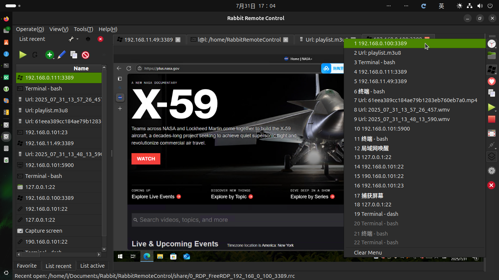
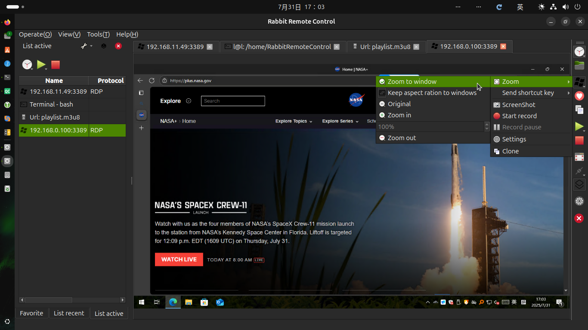
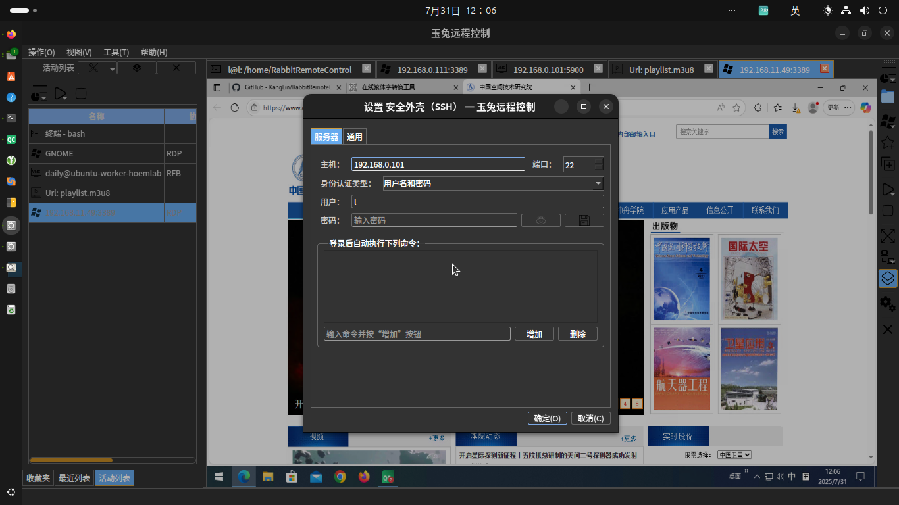

# [Rabbit Remote Control](https://github.com/KangLin/RabbitRemoteControl)

Author: Kang Lin <kl222@126.com>

-----------------------------------------------------------------------

[:cn: 中文](README_zh_CN.md)

-----------------------------------------------------------------------

- [Introduction](#Introduction)
  + [Screenshot](#Screenshot)
    - [Multiple style](#Multiple-style)
  + [Project repository position](#Project-repository-position)
- [Functions](#Functions)
  + [Supported operating system](#Supported-operating-system)
  + [Supported multiple languages](#Supported-multiple-languages)
  + [Supported protocols](#Supported-protocols)
    - [Remote control protocols](#Remote-control-protocols)
    - [Network protocols](#Network-protocols)
  + [Function list](#Function-list)
  + [Plugins](#Plugins)
- [Status](#Status)
- [Sponsorship and Donations](#Sponsorship-and-Donations)
- [Contribution](#Contribution)
- [Download](#Download)
- [Change log](ChangeLog.md)
- [Development](#Development)
  + [Compilation](#Compilation)
    - [Compiling for Linux](docs/Compile/Linux.md)
    - [Compiling for Windows](docs/Compile/Windows.md)
- [License Agreement](#License-Agreement)

-----------------------------------------------------------------------

## Introduction

**Rabbit Remote Control** is a open-source, cross-platform, multi-protocol remote control software.

**Allows you to use any device and system in anywhere and remotely manage any device and system in any way**. 

It include remote desktop, remote control, remote terminal, player, network tools etc functions.

### Screenshot

|Main window|Recent list menu|Connect|Work|
|--|--|--|--|
|||||

#### Multiple style

|Default style|Black-Green style|Black style|White style|
|:-------:|:------:|:-------:|:------:|
|||||

### Video

https://github.com/user-attachments/assets/6924ec88-5f8c-43e8-8c62-0ed82f73ee83

### Project repository position

- Main repository: https://github.com/KangLin/RabbitRemoteControl
- Mirror repository:
  - sourceforge: https://sourceforge.net/projects/rabbitremotecontrol/
  - gitlab: https://gitlab.com/kl222/RabbitRemoteControl
  - launchpad: https://launchpad.net/rabbitremotecontrol
  - gitee: https://gitee.com/kl222/RabbitRemoteControl
  - bitbucket: https://bitbucket.org/kl222/rabbitremotecontrol

## Functions

### Supported operating system

- [x] Windows 7 SP1 and later
- [x] Unix/Linux
- [x] [Android](https://doc.qt.io/qt-6/android.html)
- [x] mac os

See: [Qt5](https://doc.qt.io/qt-5/supported-platforms.html),
[Qt6](https://doc.qt.io/qt-6/supported-platforms.html)

I have no the mac devices so I did not compile and test. Please test by yourself if you have devices.
Interested and capable friends are welcome to participate in the development of the project.

If you want to donate the developed devices for me, please contact: (email: kl222@126.com)

- Remote desktop

|        |Windows|Unix/linux|Android|MAC|
|--------|:-----:|:--------:|:-----:|:-:|
|vnc     |✓      |✓         |✓      |✓  |
|RDP     |✓      |✓         |……     |✓  |
|Spice   |       |          |       |   |
|Scrcpy  |       |          |       |   |

- Terminal

|        |Windows|Unix/linux|Android|MAC|
|--------|-------|----------|-------|---|
|Terminal|       |✓         |       |   |
|SSH     |       |✓         |       |   |
|TELNET  |       |✓         |       |   |

- File Transfer

|        |Windows|Unix/linux|Android|MAC|
|--------|-------|----------|-------|---|
|FTP     |       |          |       |   |
|SFTP    |       |          |       |   |

- Tool

|           |Windows|Unix/linux|Android|MAC|
|-----------|-------|----------|-------|---|
|Player     |✓      |✓         |✓      |✓  |
|Wake on lan|✓      |✓         |✓      |✓  |
|Screenshot |✓      |✓         |❌      |✓  |

Legend:  
 ✓ : completed; … : working; ⭕ : not completed; Empty: not started; ❌: not supported

### Supported multiple languages

- [x] English
- [x] Chinese
  - [x] Simplified Chinese
  - [x] Traditional Chinese

### Supported protocols

#### Remote control protocols

- [x] RFB(Remote frame buffer) is also called VNC(Virtual Network Computing): [https://github.com/rfbproto/rfbproto](https://github.com/rfbproto/rfbproto)
- [x] RDP(Remote desktop protocol): [https://github.com/FreeRDP/FreeRDP/wiki/Reference-Documentation](https://github.com/FreeRDP/FreeRDP/wiki/Reference-Documentation)
- [ ] Spice: [https://www.spice-space.org/](https://www.spice-space.org/)
- [x] SSH: [https://www.rfc-editor.org/info/rfc4251](https://www.rfc-editor.org/info/rfc4251)
  - [x] [libssh](https://api.libssh.org/stable/index.html)
- [x] TELNET: [https://www.rfc-editor.org/info/rfc318](https://www.rfc-editor.org/info/rfc318)
- [x] Terminal
- [ ] scrcpy: [https://github.com/Genymobile/scrcpy](https://github.com/Genymobile/scrcpy)
- [ ] FTP(File Transfer Protocol): [https://www.rfc-editor.org/info/rfc959](https://www.rfc-editor.org/info/rfc959)

#### Network protocols

- [x] Peer-to-Peer (P2P) protocol
  + ICE (Interactive Connectivity Establishment): [RFC 8445](https://datatracker.ietf.org/doc/rfc8445/) 
  + STUN: [RFC 5389](https://datatracker.ietf.org/doc/rfc5389/)
  + TURN(Traversal Using Relays around NAT): [RFC 5766](https://datatracker.ietf.org/doc/rfc5766/)
- [x] Proxy
  + [x] socks
  + [ ] http
  + [x] Peer-to-Peer (P2P) proxy protocol: [https://github.com/KangLin/RabbitRemoteControl/issues/7](https://github.com/KangLin/RabbitRemoteControl/issues/7)

#### Function list

|        |Server|Client|Desktop  |Clipboard|File|Audio|Redirection|P2P|Proxy|Terminal|
|:-----:|:---:|:---:|:----:|:--:|:-----:|:------:|:-----:|:-:|:--:|:-:|
|  RDP  |  ✓  |  ✓  |  ✓   |✓   | ……    |  ✓     | ……    |   |    | ❌ |
|  RFB  | ……  |  ✓  |  ✓   |✓   |       | ❌     | ❌    |✓  |  ✓ |   |
|Spice  |     |     |      |    |       |        | ❌    |   |    |   |
|Scrcpy |     |     |      |    |       |        |  ❌   |   |    |   |
|Terminal|     | ⭕  | ❌  |✓   | ❌    | ❌    | ❌    |    |   |    |
|TELNET |     | ⭕  | ❌  |✓   | ❌    | ❌    |  ❌    |   |   |    |
|  SSH  |     | ⭕  | ❌  |✓   |       | ❌     | ❌    |   |    |   |
|  FTP  |     |     | ❌  |    |       | ❌     |  ❌   |   |   |    |
| SFTP  |     |     | ❌  |    |       | ❌     |  ❌   |   |   |    |

Legend:  
 ✓ : completed; … : working; ⭕ : not completed; Empty: not started; ❌: not supported

|             | Proxy | P2P  |
|-------------|-------|------|
|RabbitVNC    |✓      | ✓    |
|TigerVNC     |✓      | ✓    |
|LibVNC       |       |      |
|FreeRDP      |       |      |

Legend:  
 ✓ : completed; … : working; ⭕ : not completed; Empty: not started; ❌: not supported

#### Plugins

- [FreeRDP](Plugins/FreeRDP/README.md)
- VNC
  - [RabbitVNC](Plugins/RabbitVNC/README.md)
  - [TigerVnc](Plugins/TigerVnc/README.md)
  - [LibVNCServer](Plugins/LibVNCServer/README.md)
- [Wake on lan](Plugins/WakeOnLan/README.md)
- [Player](Plugins/Player/README.md)
- Screen capture: Example

## Status

### Build status

| master|  develop |
|:-----:|:--------:|
||

## Sponsorship and Donations

If this software is useful to you, or you like it, please donate and support the author. Thank you!

 

If it cannot be displayed, please open:
- https://gitlab.com/kl222/RabbitCommon/-/raw/master/Src/Resource/image/Contribute_en.png
- https://sourceforge.net/p/rabbitcommon/code/ci/master/tree/Src/Resource/image/Contribute_en.png

Contact me:
- <kl222@126.com>
- [jami](https://jami.net): eddacfd6c7b70b258e511e812ffab7d3490396fa

## Contribution

- [Mailing list](https://sourceforge.net/p/rabbitremotecontrol/mailman/)
  - Developer <rabbitremotecontrol-developer@lists.sourceforge.net>
  - Discuss <rabbitremotecontrol-discuss@lists.sourceforge.net>
- [Issues](https://github.com/KangLin/RabbitRemoteControl/issues)
-  
- [Discussions](https://github.com/KangLin/RabbitRemoteControl/discussions)
- [Contributors](https://github.com/KangLin/RabbitRemoteControl/graphs/contributors):
  Thank [Contributors](https://github.com/KangLin/RabbitRemoteControl/graphs/contributors)
- Maintenance package
  - [ ] Linux
    - [ ] Debian: Need to maintain official packages
    - [ ] rpm: Need to maintain official packages
    - [x] AppImage
    - [x] Snap
    - [x] Flatpak: https://github.com/flathub/io.github.KangLin.RabbitRemoteControl
  - Windows
    - [ ] Windows store
  - [ ] Macos
  - [ ] Android

## Download

- [Change log](ChangeLog.md)
- Semantic Versioning: https://semver.org/
- Release: 
  - 
  - 
  - 
  - 
    
  - 

### Instructions for installing the package

- Windows: The extension is .exe
  - Architecture:
    - win64: RabbitRemoteControl_v0.0.34_win64_msvc2022_64_qt6.9.0_Setup.exe
      - [Download from github](https://github.com/KangLin/RabbitRemoteControl/releases/download/v0.0.34/RabbitRemoteControl_v0.0.34_win64_msvc2022_64_qt6.9.0_Setup.exe)
      - [Download from sourceforge](https://sourceforge.net/projects/rabbitremotecontrol/files/v0.0.34/RabbitRemoteControl_v0.0.34_win64_msvc2022_64_qt6.9.0_Setup.exe)
    - win32: RabbitRemoteControl_v0.0.34_win32_msvc2017_qt5.12.12_Setup.exe
      - [Download from github](https://github.com/KangLin/RabbitRemoteControl/releases/download/v0.0.34/RabbitRemoteControl_v0.0.34_win32_msvc2017_qt5.12.12_Setup.exe)
      - [Download from sourceforge](https://sourceforge.net/projects/rabbitremotecontrol/files/v0.0.34/RabbitRemoteControl_v0.0.34_win32_msvc2017_qt5.12.12_Setup.exe)
- Linux:
  - AppImage package: The extension is .AppImage , for all Linux systems
    - Architecture:
      - x86_64: RabbitRemoteControl_0.0.34_Linux_x86_64.AppImage
        - [Download from github](https://github.com/KangLin/RabbitRemoteControl/releases/download/v0.0.34/RabbitRemoteControl_0.0.34_Linux_x86_64.AppImage)
        - [Download from sourceforge](https://sourceforge.net/projects/rabbitremotecontrol/files/v0.0.34/RabbitRemoteControl_0.0.34_Linux_x86_64.AppImage)

              # Set execution permissions
              chmod a+x RabbitRemoteControl_0.0.34_Linux_x86_64.AppImage
              # Run
              ./RabbitRemoteControl_0.0.34_Linux_x86_64.AppImage
              
      - aarch64: RabbitRemoteControl_0.0.34_Linux_aarch64.AppImage
        - [Download from github](https://github.com/KangLin/RabbitRemoteControl/releases/download/v0.0.34/RabbitRemoteControl_0.0.34_Linux_aarch64.AppImage)
        - [Download from sourceforge](https://sourceforge.net/projects/rabbitremotecontrol/files/v0.0.34/RabbitRemoteControl_0.0.34_Linux_aarch64.AppImage)
  - Snap Package: Used on all Linux systems that support Snap.
    Ubuntu uses this installation package by default.
    - 
      
  - Flatpak Package: The extension is .flatpak , For all Linux systems that support Flatpak.
    Fedora uses this installation package by default.
    - 
    - Architecture:
      - x86_64: RabbitRemoteControl_v0.0.34_Linux_x86_64.flatpak
        - [Download from github](https://github.com/KangLin/RabbitRemoteControl/releases/download/v0.0.34/RabbitRemoteControl_v0.0.34_Linux_x86_64.flatpak)
        - [Download from sourceforge](https://sourceforge.net/projects/rabbitremotecontrol/files/v0.0.34/RabbitRemoteControl_v0.0.34_Linux_x86_64.flatpak)

              # Install package
              flatpak --user install RabbitRemoteControl_v0.0.34_Linux_x86_64.flatpak
              # Run
              flatpak run io.github.KangLin.RabbitRemoteControl
              # Or click the desktop icon to run
              
       - aarch64: RabbitRemoteControl_v0.0.34_Linux_aarch64.flatpak
         - [Download from github](https://github.com/KangLin/RabbitRemoteControl/releases/download/v0.0.34/RabbitRemoteControl_v0.0.34_Linux_aarch64.flatpak)
         - [Download from sourceforge](https://sourceforge.net/projects/rabbitremotecontrol/files/v0.0.34/RabbitRemoteControl_v0.0.34_Linux_aarch64.flatpak)
  - deb package: The extension is .deb , for Debian, Ubuntu, etc
    - Architecture:
      - amd64: rabbitremotecontrol_0.0.34_ubuntu-24.04_amd64.deb
        - [Download from github](https://github.com/KangLin/RabbitRemoteControl/releases/download/v0.0.34/rabbitremotecontrol_0.0.34_ubuntu-24.04_amd64.deb)
        - [Download from sourceforge](https://sourceforge.net/projects/rabbitremotecontrol/files/v0.0.34/rabbitremotecontrol_0.0.34_ubuntu-24.04_amd64.deb)

              # Install package
              sudo apt install ./rabbitremotecontrol_0.0.34_ubuntu-24.04_amd64.deb
              # Run
              rabbitremotecontrol
              # Or click the desktop icon to run

      - arm64: rabbitremotecontrol_0.0.34_ubuntu-24.04-arm_arm64.deb
        - [Download from github](https://github.com/KangLin/RabbitRemoteControl/releases/download/v0.0.34/rabbitremotecontrol_0.0.34_ubuntu-24.04-arm_arm64.deb)
        - [Download from sourceforge](https://sourceforge.net/projects/rabbitremotecontrol/files/v0.0.34/rabbitremotecontrol_0.0.34_ubuntu-24.04-arm_arm64.deb)
  - rpm package: The extension is .rpm , for RedHat, Fedora, CentOS etc
    - Architecture:
      - x86_64: rabbitremotecontrol-0.0.34-1.fc41.x86_64.rpm
        - [Download from github](https://github.com/KangLin/RabbitRemoteControl/releases/download/v0.0.34/rabbitremotecontrol-0.0.34-1.fc41.x86_64.rpm)
        - [Download from sourceforge](https://sourceforge.net/projects/rabbitremotecontrol/files/v0.0.34/rabbitremotecontrol-0.0.34-1.fc41.x86_64.rpm)

              # Install package
              dnf install rabbitremotecontrol-0.0.33-1.fc41.x86_64.rpm
              # Run
              rabbitremotecontrol
              # Or click the desktop icon to run

      - aarch64: rabbitremotecontrol-0.0.34-1.fc41.aarch64.rpm
        - [Download from github](https://github.com/KangLin/RabbitRemoteControl/releases/download/v0.0.34/rabbitremotecontrol-0.0.34-1.fc41.aarch64.rpm)
        - [Download from sourceforge](https://sourceforge.net/projects/rabbitremotecontrol/files/v0.0.34/rabbitremotecontrol-0.0.34-1.fc41.aarch64.rpm)
- Android: The extension is .apk
  - Architecture:
    - arm64_v8a: RabbitRemoteControl_v0.0.34_android_arm64_v8a_qt6.9.0_Release.apk
      - [Download from github](https://github.com/KangLin/RabbitRemoteControl/releases/download/v0.0.34/RabbitRemoteControl_v0.0.34_android_arm64_v8a_qt6.9.0_Release.apk)
      - [Download from sourceforge](https://sourceforge.net/projects/rabbitremotecontrol/files/v0.0.34/RabbitRemoteControl_v0.0.34_android_arm64_v8a_qt6.9.0_Release.apk)
    - x86_64: RabbitRemoteControl_v0.0.34_android_x86_64_qt6.9.0_Release.apk
      - [Download from github](https://github.com/KangLin/RabbitRemoteControl/releases/download/v0.0.34/RabbitRemoteControl_v0.0.34_android_x86_64_qt6.9.0_Release.apk)
      - [Download from sourceforge](https://sourceforge.net/projects/rabbitremotecontrol/files/v0.0.34/RabbitRemoteControl_v0.0.34_android_x86_64_qt6.9.0_Release.apk)
- Apple OS: RabbitRemoteControl_v0.0.34_macos.zip.
  No tests were carried out as there was no relevant equipment.
  We hope that interested friends will participate in the development and testing.
  - [Download from github](https://github.com/KangLin/RabbitRemoteControl/releases/download/v0.0.34/RabbitRemoteControl_v0.0.34_macos.zip)
  - [Download from sourceforge](https://sourceforge.net/projects/rabbitremotecontrol/files/v0.0.34/RabbitRemoteControl_v0.0.34_macos.zip)
- Development documentation: RabbitRemoteControl_v0.0.34_document.zip
  - [Download from github](https://github.com/KangLin/RabbitRemoteControl/releases/download/v0.0.34/RabbitRemoteControl_v0.0.34_document.zip)
  - [Download from sourceforge](https://sourceforge.net/projects/rabbitremotecontrol/files/v0.0.34/RabbitRemoteControl_v0.0.34_document.zip)
## [Development](docs/Doxygen/Develop.md)

### Development documentation online
- [sourceforge](https://rabbitremotecontrol.sourceforge.io/v0.0.34/English/html/index.html)
- [github.io](https://kanglin.github.io/RabbitRemoteControl/English/html/index.html)

### Compilation
- [Compiling for Linux](docs/Compile/Linux.md)
- [Compiling for Windows](docs/Compile/Windows.md)

## [License Agreement](License.md "License.md")

Please abide by the [License Agreement](License.md "License.md") of this project
and the license agreement of the [dependent library](#Dependent-libraries),
and thank the authors of [dependent library](#Dependent-libraries) and [tools](#Tools).
