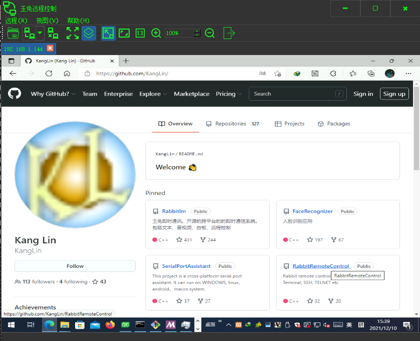

# [Rabbit Remote Control](https://github.com/KangLin/RabbitRemoteControl)

Author: Kang Lin <kl222@126.com>

-----------------------------------------------------------------------

## Stargazers over time

-----------------------------------------------------------------------

[:cn: 中文](README_zh_CN.md)

-----------------------------------------------------------------------

- [Introduction](#Introduction)
- [Build status](#Build-status)
- [Sponsorship and Donations](#Sponsorship-and-Donations)
- [Contribution](#Contribution)
- [Road map](#Road-map)
- [Download](#Download)
- [Development](#Development)
  + [Build](#Build)
    - [Linux](docs/Compile/BuildLinux.md)
    - [Windows](docs/Compile/BuildWindows.md)
- [Change log](ChangeLog.md)
- [License Agreement](#License-Agreement)

-----------------------------------------------------------------------

### Introduction
Rabbit Remote Control is a cross-platform, multi-protocol remote control software.

**Allows you to use any device and system in anywhere and remotely manage any device and system in any way**. 

#### Screenshot

|Main window|Recent list menu|Connect|
|--|--|--|
||||

#### Project repository position
- Project home: [https://kanglin.github.io/RabbitRemoteControl/](https://kanglin.github.io/RabbitRemoteControl/)
- Project position:
  - Main repository: https://github.com/KangLin/RabbitRemoteControl
  - Mirror repository: https://gitlab.com/kl222/RabbitRemoteControl

#### Supported operating system (See: [https://doc.qt.io/qt-5/supported-platforms.html](https://doc.qt.io/qt-5/supported-platforms.html))
- [x] Windows
- [x] Unix/Linux
- [x] Android
- [ ] mac os
- [ ] IPHONE
- [ ] WINCE

I have no devices so I did not compile and test. Please test by yourself if you have devices.
Interested and capable friends are welcome to participate in the development of the project.

If you want to donate the developed devices for me, please contact: (email: kl222@126.com)

#### Supported protocols
##### Remote control protocols
- [x] VNC (Virtual Network Computing): [RFB("remote framebuffer"): https://github.com/rfbproto/rfbproto](https://github.com/rfbproto/rfbproto)
- [x] Remote desktop protocol: [RDP: https://github.com/FreeRDP/FreeRDP/wiki/Reference-Documentation](https://github.com/FreeRDP/FreeRDP/wiki/Reference-Documentation)
- [ ] [Spice: https://www.spice-space.org/](https://www.spice-space.org/)
- [x] [SSH]()
- [x] [TELNET: http://www.faqs.org/rfcs/rfc855.html](http://www.faqs.org/rfcs/rfc855.html)
- [x] Terminal
- [ ] scrcpy: [https://github.com/Genymobile/scrcpy](https://github.com/Genymobile/scrcpy)

|        |Windows           |Unix/linux        |Android           |MAC               |IPHONE            |WINCE             |
|--------|------------------|------------------|------------------|------------------|------------------|------------------|
|vnc     |:heavy_check_mark:|:heavy_check_mark:|                  |                  |                  |                  |
|RDP     |:heavy_check_mark:|:heavy_check_mark:|                  |                  |                  |                  |
|Spice   |                  |                  |                  |                  |                  |                  |
|SSH     |                  |:heavy_check_mark:|                  |                  |                  |                  |
|Terminal|                  |:heavy_check_mark:|                  |                  |                  |                  |
|TELNET  |                  |:heavy_check_mark:|                  |                  |                  |                  |
|Scrcpy  |                  |                  |                  |                  |                  |                  |

##### Network protocols
- [x] Custom p2p protocol
  + ICE
  + STUN
  + TURN
- [x] Proxy
  + [x] socks
  + [ ] http
  + [x] Custom p2p proxy protocol: [https://github.com/KangLin/RabbitRemoteControl/issues/7](https://github.com/KangLin/RabbitRemoteControl/issues/7)

|             | Proxy            | P2P              |
|-------------|------------------|------------------|
|TigerVnc     |:heavy_check_mark:|:heavy_check_mark:|
|LibVNC       |                  |                  |
|FreeRDP      |                  |                  |

### Build status

- 
  
#### Github actions

|     | master  | develop  |
|:---:|:-----------:|:------------:|
|Linux||
|Windows||
|Android||

### Sponsorship and Donations
If this software is useful to you, or you like it, please donate and support the author. Thank you!

 

If it cannot be displayed, please open:
https://gitee.com/kl222/RabbitCommon/raw/master/Src/Resource/image/Contribute.png

### Contribution

- [Issues](https://github.com/KangLin/RabbitRemoteControl/issues)
-  
- [Discussions](https://github.com/KangLin/RabbitRemoteControl/discussions)
- [Contributors](https://github.com/KangLin/RabbitRemoteControl/graphs/contributors): Thank contributors

If you're wondering how could you help, fear not, there are plenty of ways:

Some of them are:

* [Donation](#Donation) - Provide funds and devices for this project :smile:
  + The project is need server with public IP
* Spread the good word about [RabbitRemoteControl](https://github.com/KangLin/RabbitRemoteControl) to make it more popular :smile:
* Have an opinion? Make sure to voice it in the [Discussions](https://github.com/KangLin/RabbitRemoteControl/discussions) that need it :wink:
* Fixing easy [Issues](https://github.com/KangLin/RabbitRemoteControl/issues) or [Issues](https://github.com/KangLin/RabbitRemoteControl/issues) that need help. Make sure to read
  [Contributing](#Contribution) first though :wink:
* Testing and [reporting bugs](https://github.com/KangLin/RabbitRemoteControl/issues)
* Translating, it's easy :smile:
* Reviewing and testing pull requests – you don't need to be able to code to
  do that :wink:
* Distribute this program to various operating systems
  - Linux
    + Ubuntu, Debian
    + Redhat
    + openSUSE
    + FreeBSD
    + CentOS
    + Arch Linux
  - Unix
  - Windows 10 mall
  - Android
* Be finished [unsupported protocols](#Supported-protocols)

### Road map
- [x] Support common existing remote control protocols
  - [x] Client
    - [x] Client frame
      - [x] Remote desktop
      - [x] Terminal（Linux implemented，but it is has a smae BUG）
    - [x] Specific protocol support, see: [Supported protocol](#Supported-protocols)
    - [x] Custom point-to-point remote control protocol, see requirements for details: https://github.com/KangLin/RabbitRemoteControl/issues/7
  - [x] Server
    - [x] Server framework
    - [x] Specific protocol support, see: [Supported protocol](#Supported-protocols)
    - [x] Custom point-to-point remote control protocol, see requirements for details: https://github.com/KangLin/RabbitRemoteControl/issues/7
- [x] Custom point-to-point remote control protocol, see requirements for details: https://github.com/KangLin/RabbitRemoteControl/issues/7

|            |       Client     |    Server        |        P2P        |
|------------|------------------|------------------|------------------|
|TigerVNC    |:heavy_check_mark:|:heavy_check_mark:|:heavy_check_mark:|
|LibVNCServer|:heavy_check_mark:|:heavy_check_mark:|                  |
|RDP         |:heavy_check_mark:|                  |                  |
|Spice       |                  |                  |                  |
|SSH         |:heavy_check_mark:|                  |                  |
|Terminal    |:heavy_check_mark:|                  |                  |
|TELNET      |:heavy_check_mark:|                  |                  |
|Scrcpy      |                  |                  |                  |

At present, the development of common remote control protocol client has been completed,
and it has preliminary practical functions.
It is necessary for small partners to try it out, find BUG,
and put forward suggestions that can be more convenient to use in practical applications.

For terminal remote control, because qtermwidget only supports LINUX/UNIX, it needs to support other platforms.

The next level of work is to solve point-to-point remote control,
which is also a feature of this project.
See requirements for details: https://github.com/KangLin/RabbitRemoteControl/issues/7 

### Download

+ Latest Release: [https://github.com/KangLin/RabbitRemoteControl/releases/latest](https://github.com/KangLin/RabbitRemoteControl/releases/latest)

+ Current version:
  - Windows: Supported WINDOWS 7 and later version
    + Install package: [RabbitRemoteControl_setup_v0.0.10.exe](https://github.com/KangLin/RabbitRemoteControl/releases/download/v0.0.10/RabbitRemoteControl_setup_v0.0.10.exe)
    + No need to install package: [RabbitRemoteControl_v0.0.10.zip](https://github.com/KangLin/RabbitRemoteControl/releases/download/v0.0.10/RabbitRemoteControl_windows_v0.0.10.zip)
  - Ubuntu:
    + Ubuntu 20.04: [rabbitremotecontrol_0.0.10_amd64_Ubuntu-20.04.deb](https://github.com/KangLin/RabbitRemoteControl/releases/download/v0.0.10/rabbitremotecontrol_0.0.10_amd64_Ubuntu-20.04.deb)
          
          sudo apt install rabbitremotecontrol_0.0.10_amd64_Ubuntu-20.04.deb
          
          # If you're on an older Linux distribution, you will need to run this instead:
          # sudo dpkg -i rabbitremotecontrol_0.0.10_amd64_Ubuntu-20.04.deb
          # sudo apt-get install -f # Install dependencies
          
    + Ubuntu 18.04: [rabbitremotecontrol_0.0.10_amd64_Ubuntu-18.04.deb](https://github.com/KangLin/RabbitRemoteControl/releases/download/v0.0.10/rabbitremotecontrol_0.0.10_amd64_Ubuntu-18.04.deb)

          sudo apt install rabbitremotecontrol_0.0.10_amd64_Ubuntu-18.04.deb
          
          # If you're on an older Linux distribution, you will need to run this instead:
          # sudo dpkg -i rabbitremotecontrol_0.0.10_amd64_Ubuntu-18.04.deb
          # sudo apt-get install -f # Install dependencies

### Development
#### Dependent
##### Tools
- [Qt](qt.io)
- C/C++ compiler
  + gcc/g++
  + MSVC
- [CMake](https://cmake.org/)
- Automake、 Autoconf、 Make
- Git

##### Dependent libraries
- [x] [MUST] RabbitCommon：https://github.com/KangLin/RabbitCommon
- [x] VNC
  + [x] [Optional] LibVNCServer: https://github.com/LibVNC/libvncserver
  + [x] [Optional] TigerVNC: https://github.com/KangLin/tigervnc
- [x] [Optional] FreeRDP: https://github.com/FreeRDP/FreeRDP
- [x] [Optional] [SSH]
  + [x] LIBSSH: https://www.libssh.org
  + [ ] LIBSSH2: https://www.libssh2.org/ https://github.com/libssh2/libssh2
- [x] [Optional] QTermWidget: https://github.com/lxqt/qtermwidget
- [x] [Optional] libtelnet: https://github.com/seanmiddleditch/libtelnet
- [ ] [Optional] scrcpy: [https://github.com/Genymobile/scrcpy](https://github.com/Genymobile/scrcpy)
- [x] [Optional] libdatachannel: [https://github.com/paullouisageneau/libdatachannel](https://github.com/paullouisageneau/libdatachannel)
- [x] [OPTIONAL] QXmpp: https://github.com/qxmpp-project/qxmpp
- [x] [Optional] QtService: https://github.com/KangLin/qt-solutions/

#### Build
- [Linux](docs/Compile/BuildLinux.md)
- [Windows](docs/Compile/BuildWindows.md)

### [License Agreement](License.md "License.md")

Please abide by this agreement and the license agreement of [dependent library](#Dependent-libraries),
and thank the author of [dependent library](#Dependent-libraries) and [tools](#Tools).
