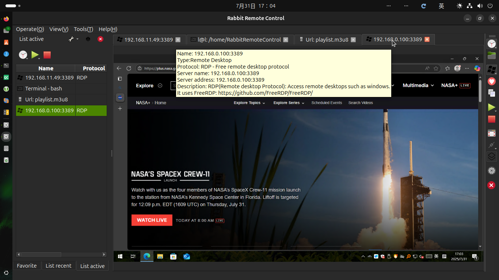

# [Rabbit Remote Control](https://github.com/KangLin/RabbitRemoteControl)

Author: Kang Lin <kl222@126.com>

-----------------------------------------------------------------------

[:cn: 中文](README_zh_CN.md)

-----------------------------------------------------------------------

- [Introduction](#Introduction)
  + [Screenshot](#Screenshot)
    - [Multiple style](#Multiple-style)
  + [Project repository position](#Project-repository-position)
- [Functions](#Functions)
  + [Supported operating system](#Supported-operating-system)
  + [Supported multiple languages](#Supported-multiple-languages)
  + [Supported protocols](#Supported-protocols)
    - [Remote control protocols](#Remote-control-protocols)
    - [Network protocols](#Network-protocols)
  + [Function list](#Function-list)
  + [Plugins](#Plugins)
- [Status](#Status)
- [Sponsorship and Donations](#Sponsorship-and-Donations)
- [Contribution](#Contribution)
- [Download](#Download)
- [Development](#Development)
  + [Compilation](#Compilation)
    - [Compiling for Linux](docs/Compile/Linux.md)
    - [Compiling for Windows](docs/Compile/Windows.md)
- [License Agreement](#License-Agreement)

-----------------------------------------------------------------------

## Introduction

**Rabbit Remote Control** is an open-source, cross-platform, multi-protocol remote control software.

**Allows you to use any device and system from anywhere and remotely manage any device and system in any way**. 

Its goal is to be simple, convenient, secure and easy to use, improving work efficiency.

It includes remote desktop, remote control, file transfer (FTP, SFTP), terminal, remote terminal (SSH, Telnet), player, network tools, and more.

### Screenshot

|Main window|Recent list menu|Connect|Work|
|--|--|--|--|
|||||

#### Multiple style

|Default style|Black-Green style|Black style|White style|
|:-------:|:------:|:-------:|:------:|
|||||

### Video

https://github.com/user-attachments/assets/11951698-762a-4771-b4c7-c669788bdc25

### Project repository position

- Main repository: https://github.com/KangLin/RabbitRemoteControl
- Mirror repository:
  - sourceforge: https://sourceforge.net/projects/rabbitremotecontrol/
  - gitlab: https://gitlab.com/kl222/RabbitRemoteControl
  - launchpad: https://launchpad.net/rabbitremotecontrol
  - gitee: https://gitee.com/kl222/RabbitRemoteControl
  - bitbucket: https://bitbucket.org/kl222/rabbitremotecontrol

## Functions

### Supported operating system

- [x] Windows 7 SP1 and later
- [x] Unix/Linux
- [x] [Android](https://doc.qt.io/qt-6/android.html)
- [x] mac os

See: [Qt5](https://doc.qt.io/qt-5/supported-platforms.html),
[Qt6](https://doc.qt.io/qt-6/supported-platforms.html)

I do not have Mac devices, so I did not compile and test. Please test by yourself if you have Mac devices.
Interested and capable friends are welcome to participate in the development of the project.

If you want to donate the development devices to me, please contact: (email: kl222@126.com)

- Remote desktop

|        |Windows|Unix/linux|Android|MAC|
|--------|:-----:|:--------:|:-----:|:-:|
|vnc     |✓      |✓         |✓      |✓  |
|RDP     |✓      |✓         |……     |✓  |
|Spice   |       |          |       |   |
|Scrcpy  |       |          |       |   |

- Terminal

|             |Windows|Unix/linux|Android|MAC|
|-------------|-------|----------|-------|---|
|Terminal     |✓      |✓         |       |✓  |
|SSH          |✓      |✓         |       |✓  |
|TELNET       |✓      |✓         |       |✓  |
|Serial port  |✓      |✓         |       |✓  |

- File Transfer

|        |Windows|Unix/linux|Android|MAC|
|--------|-------|----------|-------|---|
|FTP     |✓      |✓         |✓      |✓  |
|SFTP    |✓      |✓         |✓      |✓  |

- Tool

|           |Windows|Unix/linux|Android|MAC|
|-----------|-------|----------|-------|---|
|Player     |✓      |✓         |✓      |✓  |
|Wake on lan|✓      |✓         |✓      |✓  |
|Screenshot |✓      |✓         |       |✓  |
|Web browser|✓      |✓         |❌     |✓  |

Legend:  
 ✓ : completed; … : working; ⭕ : not completed; Empty: not started; ❌: not supported

### Supported multiple languages

- [x] English
- [x] Chinese
  - [x] Simplified Chinese
  - [x] Traditional Chinese

### Supported protocols

#### Remote control protocols

- [x] RFB(Remote frame buffer) is also called VNC(Virtual Network Computing): [https://github.com/rfbproto/rfbproto](https://github.com/rfbproto/rfbproto)
- [x] RDP(Remote desktop protocol): [https://github.com/FreeRDP/FreeRDP/wiki/Reference-Documentation](https://github.com/FreeRDP/FreeRDP/wiki/Reference-Documentation)
- [ ] Spice: [https://www.spice-space.org/](https://www.spice-space.org/)
- [x] SSH: [https://www.rfc-editor.org/info/rfc4251](https://www.rfc-editor.org/info/rfc4251)
  - [x] [libssh](https://api.libssh.org/stable/index.html)
- [x] TELNET: [https://www.rfc-editor.org/info/rfc318](https://www.rfc-editor.org/info/rfc318)
- [x] Terminal
- [ ] scrcpy: [https://github.com/Genymobile/scrcpy](https://github.com/Genymobile/scrcpy)
- [ ] FTP(File Transfer Protocol): [https://www.rfc-editor.org/info/rfc959](https://www.rfc-editor.org/info/rfc959)
- [x] SFTP(Secure Shell File Transfer Protocol): [https://tools.ietf.org/html/draft-ietf-secsh-filexfer-02](https://tools.ietf.org/html/draft-ietf-secsh-filexfer-02)

#### Network protocols

- [x] Peer-to-Peer (P2P) protocol
  + ICE (Interactive Connectivity Establishment): [RFC 8445](https://datatracker.ietf.org/doc/rfc8445/) 
  + STUN: [RFC 5389](https://datatracker.ietf.org/doc/rfc5389/)
  + TURN(Traversal Using Relays around NAT): [RFC 5766](https://datatracker.ietf.org/doc/rfc5766/)
- [x] Proxy
  + [x] socks
  + [ ] http
  + [x] Peer-to-Peer (P2P) proxy protocol: [https://github.com/KangLin/RabbitRemoteControl/issues/7](https://github.com/KangLin/RabbitRemoteControl/issues/7)

#### Function list

|            |Server|Client|Desktop  |Clipboard|File|Audio|Redirection|P2P|Proxy|Terminal|
|:---------:|:-----:|:---:|:-------:|:-------:|:--:|:---:|:---------:|:-:|:---:|:------:|
|  RDP      |  ✓    |  ✓  |     ✓   |✓        | …… |  ✓  | ……        |   | ✓   | ❌     |
|  RFB      | ……    |  ✓  |     ✓   |✓        |    | ❌  | ❌         |✓ |  ✓   |       |
|Spice      |       |     |         |         |    |     | ❌        |   |      |       |
|Scrcpy     |       |     |         |         |    |     | ❌        |   |      |       |
|Terminal   |       |  ✓  | ❌      |✓        | ❌ | ❌  | ❌        |   |      |       |
|TELNET     |       |  ✓  | ❌      |✓        | ❌ | ❌  |  ❌       |   |      |       |
|  SSH      |       |  ✓  | ❌      |✓        |    | ❌  | ❌        |   |      |       |
|Serial port|       |  ✓  | ❌      |✓        |    | ❌  | ❌        |   |      |       |
|  FTP      |       |  ✓  | ❌      |         | ✓  |      |  ❌       |   |      |       |
| SFTP      |       |  ✓  | ❌      |         | ✓  |      |  ❌       |   |      |       |

Legend:  
 ✓ : completed; … : working; ⭕ : not completed; Empty: not started; ❌: not supported

|             | Proxy | P2P  |
|-------------|-------|------|
|RabbitVNC    |✓      | ✓    |
|TigerVNC     |✓      | ✓    |
|LibVNC       |       |      |
|FreeRDP      |       |      |

Legend:  
 ✓ : completed; … : working; ⭕ : not completed; Empty: not started; ❌: not supported

#### Plugins

- [FreeRDP](Plugins/FreeRDP/README.md)
- VNC
  - [RabbitVNC](Plugins/RabbitVNC/README.md)
  - [TigerVnc](Plugins/TigerVnc/README.md)
  - [LibVNCServer](Plugins/LibVNCServer/README.md)
- [Wake on lan](Plugins/WakeOnLan/README.md)
- [Player](Plugins/Player/README.md)
- [Screen capture: Example](Plugins/ScreenCapture)
- Terminal
  - [Terminal](Plugins/Terminal)
  - [SSH](Plugins/SSH)
  - [TELNET](Plugins/Telnet)
  - [Serial Port](Plugins/SerialPort)
- [File transfer](Plugins/FileTransfer)
- [Web browser](Plugins/WebBrowser)

## Status

#### Stargazers over time

### Build status

| master|  develop |
|:-----:|:--------:|
||

## Sponsorship and Donations

If this software is useful to you, or you like it, please donate and support the author. Thank you!

 

If it cannot be displayed, please open:
- https://gitlab.com/kl222/RabbitCommon/-/raw/master/Src/Resource/image/Contribute_en.png
- https://sourceforge.net/p/rabbitcommon/code/ci/master/tree/Src/Resource/image/Contribute_en.png

Contact me:
- <kl222@126.com>
- [jami](https://jami.net): eddacfd6c7b70b258e511e812ffab7d3490396fa

## Contribution

- [Mailing list](https://sourceforge.net/p/rabbitremotecontrol/mailman/)
  - Developer <rabbitremotecontrol-developer@lists.sourceforge.net>
  - Discuss <rabbitremotecontrol-discuss@lists.sourceforge.net>
- [Issues](https://github.com/KangLin/RabbitRemoteControl/issues)
-  
- [Discussions](https://github.com/KangLin/RabbitRemoteControl/discussions)
- [Contributors](https://github.com/KangLin/RabbitRemoteControl/graphs/contributors):
  Thank [Contributors](https://github.com/KangLin/RabbitRemoteControl/graphs/contributors)
- Maintenance package
  - [ ] Linux
    - [ ] Debian: Need to maintain official packages
    - [ ] rpm: Need to maintain official packages
    - [x] AppImage
    - [x] Snap: https://snapcraft.io/rabbitremotecontrol
    - [x] Flatpak: https://github.com/flathub/io.github.KangLin.RabbitRemoteControl
  - Windows
    - [ ] Windows store: Need to maintain official packages
  - [ ] macOS: Need to maintain official packages
  - [ ] Android: Need to maintain official packages

## Download

- [Change log](ChangeLog.md)
- Semantic Versioning: https://semver.org/
- [User manual](https://github.com/KangLin/RabbitRemoteControl/wiki/UserManual)
- Release: 
  - 
  - 
  - 
  - 
    
  - 

## [Development](docs/Doxygen/Develop.md)

### Development documentation online
- [sourceforge](https://rabbitremotecontrol.sourceforge.io/v0.0.36/English/html/index.html)
- [github.io](https://kanglin.github.io/RabbitRemoteControl/English/html/index.html)

### Compilation
- [Compiling for Android](docs/Compile/Android_zh_CN.md)
- [Compiling for Linux](docs/Compile/Linux.md)
- [Compiling for Windows](docs/Compile/Windows.md)
- [Compiling for macOS](docs/Compile/macOS.md)

## [License Agreement](License.md "License.md")

Please abide by the [License Agreement](License.md "License.md") of this project
and the license agreement of the [dependent library](#Dependent-libraries),
and thank the authors of [dependent library](#Dependent-libraries) and [tools](#Tools).
