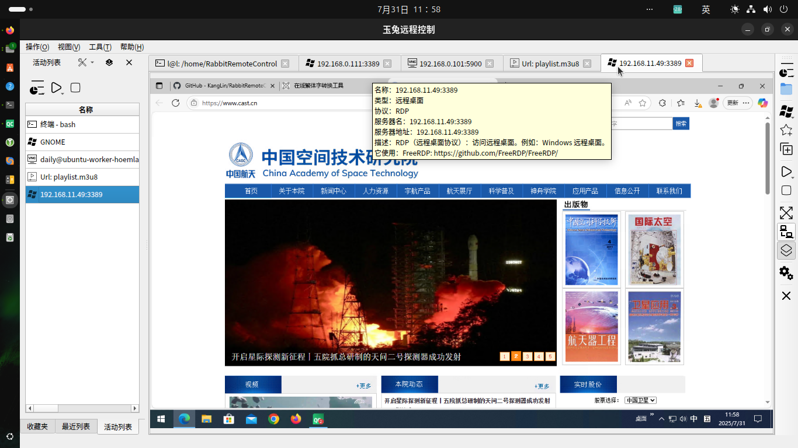

# [玉兔远程控制](https://github.com/KangLin/RabbitRemoteControl)

作者: 康林 <kl222@126.com>

-----------------------------------------------------------------------

[:us: English](README.md)

-----------------------------------------------------------------------

- [简介](#简介)
  + [截屏](#截屏)
    - [多样式](#多样式)
  + [项目位置](#项目位置)
- [功能](#功能)
  + [支持操作系统](#支持操作系统)
  + [支持多语言](#支持多语言)
  + [支持协议](#支持协议)
    - [远程控制协议](#远程控制协议)
    - [网络协议](#网络协议)
  + [功能列表](#功能列表)
  + [插件](#插件)
  + [详尽文档](#详尽文档)
- [状态](#状态)
- [捐赠](#捐赠)
- [贡献](#贡献)
- [线路图](#线路图)
- [修改日志](ChangeLog_zh_CN.md)
- [下载](#下载)
- [开发](#开发)
  + [编译](#编译)
    - [为 Linux 编译](docs/Compile/Linux_zh_CN.md)
    - [为 Windows 编译](docs/Compile/Windows_zh_CN.md)
- [许可协议](#许可协议)

-----------------------------------------------------------------------
## 简介

玉兔远程控制是一个跨平台，支持多协议的远程控制软件。

能让你在**任何地方**使用**任何设备和系统**通过**任意方式**远程管理**任意设备和系统**。

它包括远程桌面、远程终端等远程控制功能。

### 截屏

|主窗口|最近列表窗口|连接窗口|工作窗口|
|--|--|--|--|
|||||

#### 多样式

|默认样式|黑绿样式|黑色样式|白色样式|
|:-------:|:------:|:-------:|:------:|
|||||

### 项目位置

+ 主库：https://github.com/KangLin/RabbitRemoteControl
+ 镜像：
  - 中国镜像：https://gitee.com/kl222/RabbitRemoteControl
  - sourceforge: https://sourceforge.net/projects/rabbitremotecontrol
  - gitlab: https://gitlab.com/kl222/RabbitRemoteControl
  - launchpad: https://launchpad.net/rabbitremotecontrol

## 功能

### 支持操作系统

参见：[https://doc.qt.io/qt-5/supported-platforms.html](https://doc.qt.io/qt-5/supported-platforms.html)

- [x] Windows 7 SP1 及以后
- [x] Unix/Linux
- [x] Android
- [ ] mac os
- [ ] IPHONE
- [ ] WINCE

未选中的操作系统是因为本人没有设备，所以没有做编译与测试。请有设备的朋友自行测试。
欢迎有兴趣，有能力的朋友参与项目的开发。

如果你想为本人捐赠开发设备，请联系：kl222@126.com

详见：[Qt5 支持平台](https://doc.qt.io/qt-5/supported-platforms.html)、[Qt6 支持平台](https://doc.qt.io/qt-6/supported-platforms.html)。

|        |Windows|Unix/linux|Android|MAC|IPHONE|WINCE|
|--------|-------|----------|-------|---|------|-----|
|vnc     |✓      |✓         |       |   |      |     |
|RDP     |✓      |✓         |       |   |      |     |
|Spice   |       |          |       |   |      |     |
|Scrcpy  |       |          |       |   |      |     |
|终端     |       |✓         |       |   |      |     |
|SSH     |       |✓         |       |   |      |     |
|TELNET  |       |✓         |       |   |      |     |
|FTP     |       |          |       |   |      |     |

图例： ✓ :  完成; …… : 正在工作;  ⭕  : 未完成; 空：未开始; ❌: 不支持

### 支持多语言

- [x] 英语
- [x] 中文
  - [x] 简体中文
  - [x] 繁体中文

### 支持协议

#### 远程控制协议
- [x] VNC（虚拟网络计算）也叫 RFB(远程帧缓存): [https://github.com/rfbproto/rfbproto](https://github.com/rfbproto/rfbproto)
- [x] RDP（远程桌面协议）: [https://github.com/FreeRDP/FreeRDP/wiki/Reference-Documentation](https://github.com/FreeRDP/FreeRDP/wiki/Reference-Documentation)
- [ ] Spice: [https://www.spice-space.org/](https://www.spice-space.org/)
- [x] 终端
- [x] SSH: [https://www.rfc-editor.org/info/rfc4251](https://www.rfc-editor.org/info/rfc4251)
- [x] TELNET: [https://www.rfc-editor.org/info/rfc318](https://www.rfc-editor.org/info/rfc318)
- [ ] scrcpy: [https://github.com/Genymobile/scrcpy](https://github.com/Genymobile/scrcpy)
- [ ] FTP（文件传输协议）: [https://www.rfc-editor.org/info/rfc959](https://www.rfc-editor.org/info/rfc959)

#### 网络协议

- [x] 端到端（P2P）协议
  + ICE（交互式连接建立）: [RFC 8445](https://datatracker.ietf.org/doc/rfc8445/)
  + STUN: [RFC 5389](https://datatracker.ietf.org/doc/rfc5389/)
  + TURN(在 NAT 周围使用中继进行遍历): [RFC 5766](https://datatracker.ietf.org/doc/rfc5766/)
- [x] 代理
  + [x] socks
  + [ ] http
  + [x] 端到端（P2P）代理协议： [https://github.com/KangLin/RabbitRemoteControl/issues/7](https://github.com/KangLin/RabbitRemoteControl/issues/7)

#### 功能列表

|       |服务器|客户端|远程桌面|剪切板|文件传输|音频传输|资源重定向|P2P|代理|终端|
|:-----:|:---:|:---:|:----:|:--:|:-----:|:------:|:-----:|:-:|:--:|:-:|
|  RDP  |  ✓  |  ✓  |  ✓   |✓   | ……    |  ✓     | ……    |   |    | ❌ |
|  RFB  | ……  |  ✓  |  ✓   |✓   |       | ❌     | ❌   |✓  |  ✓ |   |
|Spice  |     |     |      |    |       |        | ❌   |   |    |   |
|Scrcpy |     |     |      |    |       |        | ❌   |   |    |   |
|终端    |     | ⭕  | ❌  |✓   | ❌    | ❌     | ❌  |    |   |    |
|TELNET |     | ⭕  | ❌  |✓   | ❌    | ❌    |  ❌  |   |   |    |
|  SSH  |     | ⭕  | ❌  |✓   |       | ❌     | ❌  |   |    |   |
|  FTP  |     |     | ❌  |    |       | ❌     | ❌  |   |   |    |

图例： ✓ :  完成; …… : 正在工作;  ⭕  : 未完成; 空：未开始; ❌: 不支持

|             | 代理              | P2P              |
|-------------|------------------|------------------|
|RabbitVNC    |✓                 |✓                 |
|TigerVNC     |✓                 |✓                 |
|LibVNC       |                  |                  |
|FreeRDP      |                  |                  |

图例： ✓ :  完成; …… : 正在工作;  ⭕  : 未完成; 空：未开始; ❌: 不支持

#### 插件

- [FreeRDP](Plugins/FreeRDP/README_zh_CN.md)
- VNC
  - [RabbitVNC](Plugins/RabbitVNC/README.md)
  - [TigerVnc](Plugins/TigerVnc/README.md)
  - [LibVNCServer](Plugins/LibVNCServer/README.md)

### 详尽文档

- [开发文档](https://kanglin.github.io/RabbitRemoteControl/Chinese/html/index.html)
- [编译文档](#编译)

## 状态

### 编译状态

|     | master 分支 | develop 分支 |
|:---:|:-----------:|:------------:|
|Linux||
|Windows||
|Android||

## 捐赠

本软件如果对你有用，或者你喜欢它，请你捐赠，支持作者。谢谢！

如果不能显示，请打开：
- https://gitlab.com/kl222/RabbitCommon/-/raw/master/Src/Resource/image/Contribute.png
- https://sourceforge.net/p/rabbitcommon/code/ci/master/tree/Src/Resource/image/Contribute.png

## 贡献

- [邮件列表](https://sourceforge.net/p/rabbitremotecontrol/mailman/)
  - 开发组 <rabbitremotecontrol-developer@lists.sourceforge.net>
  - 讨论组 <rabbitremotecontrol-discuss@lists.sourceforge.net>
- [问题](https://github.com/KangLin/RabbitRemoteControl/issues)
-  
- [讨论](https://github.com/KangLin/RabbitRemoteControl/discussions)
- [贡献者](https://github.com/KangLin/RabbitRemoteControl/graphs/contributors): 感谢[贡献者](https://github.com/KangLin/RabbitRemoteControl/graphs/contributors)

如果您想知道如何提供帮助，不要害怕，有很多方法：

* [捐赠](#捐赠) - 为本项目提供资金与设备支持 :smile:
  - 本项目需要具有公网 IP 的服务器
* 向你周围的人传播有关[玉兔远程控件](https://github.com/KangLin/RabbitRemoteControl)的好话，使其更受欢迎 :smile:
* 有意见吗？ 请务必在[讨论区](https://github.com/KangLin/RabbitRemoteControl/discussions)中发声，说明你的需求，帮助我们改进。 :wink:
* 帮助解决 BUG 与功能[Issues](https://github.com/KangLin/RabbitRemoteControl/issues) 。请确保先阅读过[贡献](#贡献)中的内容。 :wink:
* 测试并报告 [BUG](https://github.com/KangLin/RabbitRemoteControl/issues)
* 翻译，它很容易 :smile:
* 审核和测试 pull requests – 你不需要编写代码 :wink:
* 帮助我完成分发到常用的操作系统
  - Linux
    + Ubuntu, Debian
    + Redhat
    + openSUSE
    + FreeBSD
    + CentOS
    + Arch Linux
  - Unix
  - Windows 10 mall
  - Android
* 完成还未支持的[协议](支持协议)

## 线路图

- [x] 支持常见已有远程控制协议
  - [x] 客户端
    - [x] 客户端框架
      - [x] 远程桌面
      - [x] 控制终端（Linux下实现，但有BUG）
    - [x] 具体协议支持，详见：[支持协议](#支持协议)
    - [x] 端到端（P2P）远程控制协议，详见需求: https://github.com/KangLin/RabbitRemoteControl/issues/7
  - [x] 服务器
    - [x] 服务器框架
    - [x] 具体协议支持，详见：[支持协议](#支持协议)
    - [x] 端到端（P2P）远程控制协议，详见需求: https://github.com/KangLin/RabbitRemoteControl/issues/7
- [x] 端到端（P2P）远程控制协议，详见需求: https://github.com/KangLin/RabbitRemoteControl/issues/7
- [ ] 文件传输协议（FTP）

|            |服务器|客户端|远程桌面|剪切板|文件传输|音频传输入|资源重定向|P2P|代理|终端|
|:----------:|:---:|:---:|:----:|:---:|:-----:|:------:|:------:|:-:|:--:|:-:|
|RabbitVNC   |……   |✓    |✓     |✓    |       |❌      |❌      |✓  | ✓  |   |
|TigerVNC    |……   |✓    |✓     |✓    |       |❌      |❌      |✓  | ✓  |   |
|LibVNCServer|✓    |✓    |✓     |✓    |       |❌      |❌      |   |    |   |
|RDP         |✓    |✓    |✓     |✓    | ……    |✓       | ……     |   |    |❌ |
|Spice       |     |     |      |     |       |        |❌      |   |    |    |
|Scrcpy      |     |     |      |     |       |        |❌      |   |    |    |
|终端         |     |⭕   |❌   |✓    |       |❌      |❌      |   |    |    |
|SSH         |     |⭕   |❌   |✓    |       |❌      |❌      |   |    |    |
|TELNET      |     |⭕   |❌   |✓    |❌     |❌      |❌      |   |    |    |
|FTP         |     |     |❌   |     |       |❌      | ❌     |   |    |    |

图例： ✓ :  完成; …… : 正在工作;  ⭕  : 未完成; 空：未开始; ❌: 不支持

- 已经完成常见远程控制协议客户端和部分服务端的开发。已初步具备实用功能，需要小伙伴们试用，发现BUG，提出能更方便在实际应用中使用的建议。
- 终端类远程控制。因为 qtermwidget 仅支持 LINUX/UNIX ，所以需要让其支持其它平台。
- 已经完成端到端（P2P）远程控制。它是本项目的特点。详见需求: https://github.com/KangLin/RabbitRemoteControl/issues/7

## 下载

- [修改日志](ChangeLog_zh_CN.md)
- 版本号说明： https://semver.org/lang/zh-CN/

+ 最后发行版本：
  - 
  - 
  - 
+ 当前版本：v0.0.27
  - Windows: 支持 WINDOWS 7 及以后版本
    + 安装包：RabbitRemoteControl_setup_v0.0.27.exe
      - [从 github 下载](https://github.com/KangLin/RabbitRemoteControl/releases/download/v0.0.27/RabbitRemoteControl_setup_v0.0.27.exe)
      - [从 sourceforge 下载](https://sourceforge.net/projects/rabbitremotecontrol/files/v0.0.27/RabbitRemoteControl_setup_v0.0.27.exe/download)
    + md5 校验文件: RabbitRemoteControl_setup_v0.0.27.exe.md5sum
      - [从 github 下载](https://github.com/KangLin/RabbitRemoteControl/releases/download/v0.0.27/RabbitRemoteControl_setup_v0.0.27.exe.md5sum)
      - [从 sourceforge 下载](https://sourceforge.net/projects/rabbitremotecontrol/files/v0.0.27/RabbitRemoteControl_setup_v0.0.27.exe.md5sum/download)
    + 绿色版本：RabbitRemoteControl_windows_v0.0.27.zip
      - [从 github 下载](https://github.com/KangLin/RabbitRemoteControl/releases/download/v0.0.27/RabbitRemoteControl_windows_v0.0.27.zip)
      - [从 sourceforge 下载](https://sourceforge.net/projects/rabbitremotecontrol/files/v0.0.27/RabbitRemoteControl_windows_v0.0.27.zip/download)
    + md5 校验文件: RabbitRemoteControl_windows_v0.0.27.zip.md5sum
      - [从 github 下载](https://github.com/KangLin/RabbitRemoteControl/releases/download/v0.0.27/RabbitRemoteControl_windows_v0.0.27.zip.md5sum)
      - [从 sourceforge 下载](https://sourceforge.net/projects/rabbitremotecontrol/files/v0.0.27/RabbitRemoteControl_windows_v0.0.27.zip.md5sum/download)
  - Ubuntu:
    + Ubuntu 20.04: rabbitremotecontrol_0.0.27_amd64_Ubuntu-20.04.deb
      
          sudo apt install ./rabbitremotecontrol_0.0.27_amd64_Ubuntu-20.04.deb
          
          # 如要你是在老的 linux 发行版本上，你需要用下列命令替换：
          # sudo dpkg -i rabbitremotecontrol_0.0.27_amd64_Ubuntu-20.04.deb
          # sudo apt-get install -f # 安装依赖

      - [从 github 下载](https://github.com/KangLin/RabbitRemoteControl/releases/download/v0.0.27/rabbitremotecontrol_0.0.27_amd64_Ubuntu-20.04.deb)
      - [从 sourceforge 下载](https://sourceforge.net/projects/rabbitremotecontrol/files/v0.0.27/rabbitremotecontrol_0.0.27_amd64_Ubuntu-20.04.deb/download)
    + md5 校验文件: rabbitremotecontrol_0.0.27_amd64_Ubuntu-20.04.deb.md5sum
      - [从 github 下载](https://github.com/KangLin/RabbitRemoteControl/releases/download/v0.0.27/rabbitremotecontrol_0.0.27_amd64_Ubuntu-20.04.deb.md5sum)
      - [从 sourceforge 下载](https://sourceforge.net/projects/rabbitremotecontrol/files/v0.0.27/rabbitremotecontrol_0.0.27_amd64_Ubuntu-20.04.deb.md5sum/download)
    + Ubuntu 18.04: rabbitremotecontrol_0.0.27_amd64_Ubuntu-18.04.deb

          sudo apt install ./rabbitremotecontrol_0.0.27_amd64_Ubuntu-18.04.deb
          
          # 如要你是在老的 linux 发行版本上，你需要用下列命令替换：
          # sudo dpkg -i rabbitremotecontrol_0.0.27_amd64_Ubuntu-18.04.deb
          # sudo apt-get install -f # 安装依赖

      - [从 github 下载](https://github.com/KangLin/RabbitRemoteControl/releases/download/v0.0.27/rabbitremotecontrol_0.0.27_amd64_Ubuntu-18.04.deb)
      - [从 sourceforge 下载](https://sourceforge.net/projects/rabbitremotecontrol/files/v0.0.27/rabbitremotecontrol_0.0.27_amd64_Ubuntu-18.04.deb/download)
    + md5 校验文件: rabbitremotecontrol_0.0.27_amd64_Ubuntu-18.04.deb.md5sum
      - [从 github 下载](https://github.com/KangLin/RabbitRemoteControl/releases/download/v0.0.27/rabbitremotecontrol_0.0.27_amd64_Ubuntu-18.04.deb.md5sum)
      - [从 sourceforge 下载](https://sourceforge.net/projects/rabbitremotecontrol/files/v0.0.27/rabbitremotecontrol_0.0.27_amd64_Ubuntu-18.04.deb.md5sum/download)

## 开发

### [开发文档](https://kanglin.github.io/RabbitRemoteControl/Chinese/html/index.html)

### 依赖

#### 工具

- [Qt](qt.io)
- C/C++ compiler
  + gcc/g++
  + MSVC
- [CMake](https://cmake.org/)
- Automake、 Autoconf、 Make
- Git

#### 依赖库

- [x] [必选] RabbitCommon：https://github.com/KangLin/RabbitCommon
- [x] [可选] RFB
  + [x] [可选] RabbitVNC: https://github.com/KangLin/RabbitVNC
  + [x] [可选] LibVNCServer: https://github.com/LibVNC/libvncserver
  + [x] [可选] TigerVNC: https://github.com/KangLin/tigervnc
- [x] [可选] FreeRDP: https://github.com/FreeRDP/FreeRDP
- [x] [可选] [SSH]
  + [x] LIBSSH: https://www.libssh.org
  + [ ] LIBSSH2: https://www.libssh2.org/ https://github.com/libssh2/libssh2
- [x] [可选] QTermWidget: https://github.com/lxqt/qtermwidget
- [x] [可选] libtelnet: https://github.com/seanmiddleditch/libtelnet
- [ ] [可选] scrcpy: [https://github.com/Genymobile/scrcpy](https://github.com/Genymobile/scrcpy)
- [x] [可选] libdatachannel: [https://github.com/paullouisageneau/libdatachannel](https://github.com/paullouisageneau/libdatachannel)
- [x] [可选] QXmpp: https://github.com/qxmpp-project/qxmpp
- [x] [可选] QtService: https://github.com/KangLin/qt-solutions/

### 编译

- [为 Linux 编译](docs/Compile/Linux_zh_CN.md)
- [为 Windows 编译](docs/Compile/Windows_zh_CN.md)

## [许可协议](License.md "License.md")

请遵守本项目[许可协议](License.md "License.md")和[依赖库](#依赖库)的许可协议，并感谢[依赖库](#依赖库)和[工具](#工具)的作者。
