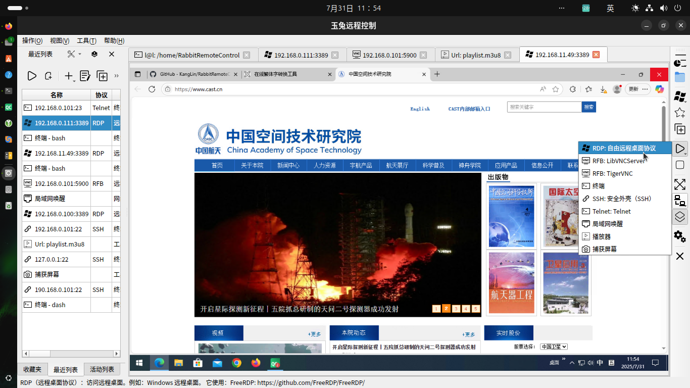
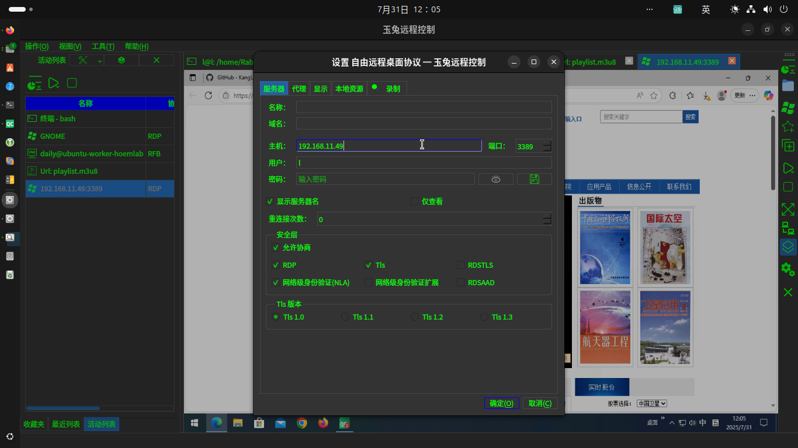

# [玉兔远程控制](https://github.com/KangLin/RabbitRemoteControl)

作者: 康林 <kl222@126.com>

-----------------------------------------------------------------------

[:us: English](README.md)

-----------------------------------------------------------------------

- [简介](#简介)
  + [截屏](#截屏)
    - [多样式](#多样式)
  + [项目位置](#项目位置)
- [功能](#功能)
  + [支持操作系统](#支持操作系统)
  + [支持多语言](#支持多语言)
  + [支持协议](#支持协议)
    - [远程控制协议](#远程控制协议)
    - [网络协议](#网络协议)
  + [功能列表](#功能列表)
  + [插件](#插件)
- [状态](#状态)
- [捐赠](#捐赠)
- [贡献](#贡献)
- [下载](#下载)
- [开发](#开发)
  + [编译](#编译)
    - [为 Linux 编译](docs/Compile/Linux_zh_CN.md)
    - [为 Windows 编译](docs/Compile/Windows_zh_CN.md)
- [许可协议](#许可协议)

-----------------------------------------------------------------------
## 简介

**玉兔远程控制**是一个开源、跨平台、支持多协议的远程控制软件。

能让你在**任何地方**使用**任何设备和系统**通过**任意方式**远程管理**任意设备和系统**。

它的目标是简单、方便、易用、安全、提高工作效率。

它包括远程桌面、远程控制、文件传输（FTP、SFTP）、终端、远程终端（SSH、TELNET）、播放器、网络工具等功能。

### 截屏

|主窗口|最近列表窗口|连接窗口|工作窗口|
|--|--|--|--|
|||||

#### 多样式

|默认样式|黑绿样式|黑色样式|白色样式|
|:-------:|:------:|:-------:|:------:|
|||||

### 视频

https://github.com/user-attachments/assets/9ebdc7e6-ed7a-4813-afcf-7a04cd6f889b

### 项目位置

+ 主库：https://github.com/KangLin/RabbitRemoteControl
+ 镜像：
  - 中国镜像：https://gitee.com/kl222/RabbitRemoteControl
  - sourceforge: https://sourceforge.net/projects/rabbitremotecontrol
  - gitlab: https://gitlab.com/kl222/RabbitRemoteControl
  - launchpad: https://launchpad.net/rabbitremotecontrol
  - bitbucket: https://bitbucket.org/kl222/rabbitremotecontrol

## 功能

### 支持操作系统

- [x] Windows 7 SP1 及以后
- [x] Unix/Linux
- [x] [Android](https://doc.qt.io/qt-6/android.html)
- [x] mac os

详见：[Qt5 支持平台](https://doc.qt.io/qt-5/supported-platforms.html)、
[Qt6 支持平台](https://doc.qt.io/qt-6/supported-platforms.html)。

因为本人没有 mac 设备，所以没有做编译与测试。请有设备的朋友自行测试。
欢迎有兴趣，有能力的朋友参与项目的开发。

如果你想为本人捐赠开发设备，请联系：kl222@126.com

- 远程桌面

|        |Windows|Unix/linux|Android|MAC|
|--------|-------|----------|-------|---|
|vnc     |✓      |✓         |✓      |✓  |
|RDP     |✓      |✓         | ……    |✓  |
|Spice   |       |          |       |   |
|Scrcpy  |       |          |       |   |

- 终端

|        |Windows|Unix/linux|Android|MAC|
|--------|-------|----------|-------|---|
|终端     |✓      |✓         |       |✓  |
|SSH     |✓      |✓         |       |✓  |
|TELNET  |       |✓         |       |✓  |
|串口     |✓      |✓         |       |✓  |

- 文件传输

|        |Windows|Unix/linux|Android|MAC|
|--------|-------|----------|-------|---|
|FTP     |……     |……        |……     |…… |
|SFTP    |……     |……        |……     |…… |

- 工具

|            |Windows|Unix/linux|Android|MAC|
|------------|-------|----------|-------|---|
|播放器       |✓      |✓         |✓      |✓  |
|局域网唤醒主机 |✓      |✓         |✓      |✓  |
|截屏         |✓      |✓         |      |✓  |
|网页浏览器    |✓      |✓         |❌     |✓  |

图例：  
 ✓ :  完成; …… : 正在工作;  ⭕  : 未完成; 空：未开始; ❌: 不支持

### 支持多语言

- [x] 英语
- [x] 中文
  - [x] 简体中文
  - [x] 繁体中文

### 支持协议

#### 远程控制协议
- [x] VNC（虚拟网络计算）也叫 RFB(远程帧缓存): [https://github.com/rfbproto/rfbproto](https://github.com/rfbproto/rfbproto)
- [x] RDP（远程桌面协议）: [https://github.com/FreeRDP/FreeRDP/wiki/Reference-Documentation](https://github.com/FreeRDP/FreeRDP/wiki/Reference-Documentation)
- [ ] Spice: [https://www.spice-space.org/](https://www.spice-space.org/)
- [x] 终端
- [x] SSH: [https://www.rfc-editor.org/info/rfc4251](https://www.rfc-editor.org/info/rfc4251)
  - [x] [libssh](https://api.libssh.org/stable/index.html)
- [x] TELNET: [https://www.rfc-editor.org/info/rfc318](https://www.rfc-editor.org/info/rfc318)
- [ ] scrcpy: [https://github.com/Genymobile/scrcpy](https://github.com/Genymobile/scrcpy)
- [x] FTP（文件传输协议）: [https://www.rfc-editor.org/info/rfc959](https://www.rfc-editor.org/info/rfc959)
- [x] SFTP(安全 Shell 文件传输协议)：[https://tools.ietf.org/html/draft-ietf-secsh-filexfer-02](https://tools.ietf.org/html/draft-ietf-secsh-filexfer-02)

#### 网络协议

- [x] 端到端（P2P）协议
  + ICE（交互式连接建立）: [RFC 8445](https://datatracker.ietf.org/doc/rfc8445/)
  + STUN: [RFC 5389](https://datatracker.ietf.org/doc/rfc5389/)
  + TURN(在 NAT 周围使用中继进行遍历): [RFC 5766](https://datatracker.ietf.org/doc/rfc5766/)
- [x] 代理
  + [x] socks
  + [ ] http
  + [x] 端到端（P2P）代理协议： [https://github.com/KangLin/RabbitRemoteControl/issues/7](https://github.com/KangLin/RabbitRemoteControl/issues/7)

#### 功能列表

|       |服务器|客户端|远程桌面|剪切板|文件传输|音频传输|资源重定向|P2P|代理|终端|
|:-----:|:---:|:---:|:----:|:--:|:-----:|:------:|:-----:|:-:|:--:|:-:|
|  RDP  |  ✓  |  ✓  |  ✓   |✓   | ……    |  ✓     | ……    |   | ✓  | ❌ |
|  RFB  | ……  |  ✓  |  ✓   |✓   |       | ❌     | ❌     |✓  | ✓ |    |
|Spice  |     |     |      |    |       |        | ❌   |   |    |   |
|Scrcpy |     |     |      |    |       |        | ❌   |   |    |   |
|终端    |     | ✓   | ❌   |✓   | ❌    | ❌     | ❌  |    |   |    |
|TELNET |     | ✓   | ❌   |✓   | ❌    | ❌    |  ❌  |   |   |    |
|  SSH  |     | ✓   | ❌   |✓   |       | ❌     | ❌  |   |    |   |
|  串口  |     | ✓   | ❌   |    |       | ❌     | ❌  |   |    |   |
|  FTP  |  ✓  | ……   | ❌   |    | ……   | ❌     | ❌  |   |   |    |
| SFTP  |     | ……   | ❌   |    | ……   | ❌     | ❌  |   |   |    |

图例：  
 ✓ :  完成; …… : 正在工作;  ⭕  : 未完成; 空：未开始; ❌: 不支持

|             | 代理              | P2P              |
|-------------|------------------|------------------|
|RabbitVNC    |✓                 |✓                 |
|TigerVNC     |✓                 |✓                 |
|LibVNC       |                  |                  |
|FreeRDP      |                  |                  |

图例：  
 ✓ :  完成; …… : 正在工作;  ⭕  : 未完成; 空：未开始; ❌: 不支持

#### 插件

- [FreeRDP](Plugins/FreeRDP/README_zh_CN.md)
- VNC
  - [RabbitVNC](Plugins/RabbitVNC/README_zh_CN.md)
  - [TigerVnc](Plugins/TigerVnc/README_zh_CN.md)
  - [LibVNCServer](Plugins/LibVNCServer/README_zh_CN.md)
- [局域网唤醒](Plugins/WakeOnLan/README_zh_CN.md)
- [播放器](Plugins/Player/README_zh_CN.md)
- 屏幕捕获：示例
- 终端
  - [本地终端](Plugins/Terminal)
  - [SSH](Plugins/SSH)
  - [TELNET](Plugins/Telnet)
  - [串口](Plugins/SerialPort)
- [文件传输](Plugins/FileTransfer/README_zh_CN.md)
- [Ftp 服务](Plugins/FtpServer/README_zh_CN.md)
- [网页浏览器](Plugins/WebBrowser)

## 状态

### 点赞数

### 编译状态

| master 分支 | develop 分支 |
|:-----------:|:------------:|
||

## 捐赠

本软件如果对你有用，或者你喜欢它，请你捐赠，支持作者。谢谢！

如果不能显示，请打开：
- https://gitlab.com/kl222/RabbitCommon/-/raw/master/Src/Resource/image/Contribute_zh_CN.png
- https://sourceforge.net/p/rabbitcommon/code/ci/master/tree/Src/Resource/image/Contribute_zh_CN.png

联系：
- <kl222@126.com>
- [jami](https://jami.net): eddacfd6c7b70b258e511e812ffab7d3490396fa

## 贡献

- [邮件列表](https://sourceforge.net/p/rabbitremotecontrol/mailman/)
  - 开发组 <rabbitremotecontrol-developer@lists.sourceforge.net>
  - 讨论组 <rabbitremotecontrol-discuss@lists.sourceforge.net>
- [问题](https://github.com/KangLin/RabbitRemoteControl/issues)
-  
- [讨论](https://github.com/KangLin/RabbitRemoteControl/discussions)
- [贡献者](https://github.com/KangLin/RabbitRemoteControl/graphs/contributors):
  感谢[贡献者](https://github.com/KangLin/RabbitRemoteControl/graphs/contributors)
- 维护打包
  - [ ] Linux
    - [ ] Debian: 需要维护官方包
    - [ ] rpm: 需要维护官方包
    - [x] AppImage
    - [x] Snap: https://snapcraft.io/rabbitremotecontrol
    - [x] Flatpak: https://github.com/flathub/io.github.KangLin.RabbitRemoteControl
  - [ ] Windows
    - [ ] Windows 应用商店: 需要维护官方包
  - [ ] Macos: 需要维护官方包
  - [ ] Android: 需要维护官方包

## 下载

- [修改日志](ChangeLog_zh_CN.md)
- 版本号说明： https://semver.org/lang/zh-CN/
- [用户手册](https://github.com/KangLin/RabbitRemoteControl/wiki/UserManual)
- 发行版本：
  - 
  - 
  - 
  - 
    
  - 

## [开发](docs/Doxygen/Develop_zh_CN.md)

### 在线开发文档
- [sourceforge](https://rabbitremotecontrol.sourceforge.io/v0.0.36/Chinese/html/index.html)
- [github.io](https://kanglin.github.io/RabbitRemoteControl/Chinese/html/index.html)

### 编译

- [为 Android 编译](docs/Compile/Android_zh_CN.md)
- [为 Linux 编译](docs/Compile/Linux_zh_CN.md)
- [为 Windows 编译](docs/Compile/Windows_zh_CN.md)
- [为 macOS 编译 (English)](docs/Compile/macOS.md)

## [许可协议](License.md "License.md")

请遵守本项目[许可协议](License.md "License.md")和[依赖库](#依赖库)的许可协议，并感谢[依赖库](#依赖库)和[工具](#工具)的作者。
