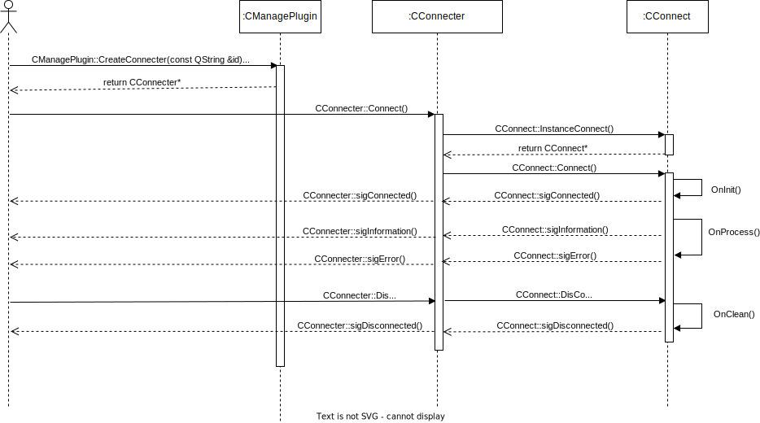

## Rabbit Remote Control Development Document

Author: Kang Lin kl222@126.com

### Project location

- Project location:
  - Main repository: [https://github.com/KangLin/RabbitRemoteControl](https://github.com/KangLin/RabbitRemoteControl)
  - Mirror repository: [https://gitlab.com/kl222/RabbitRemoteControl](https://gitlab.com/kl222/RabbitRemoteControl)

### Semantic Versioning:

- Semantic Versioning: [https://semver.org/](https://semver.org/)

### Compile

- [Linux](../Compile/Linux.md)
- [Windows](../Compile/Windows.md)

### Module

- [Module](modules.html)

- Viewer plugin API
  + class relation  
    
  + Sequence diagram   
    
