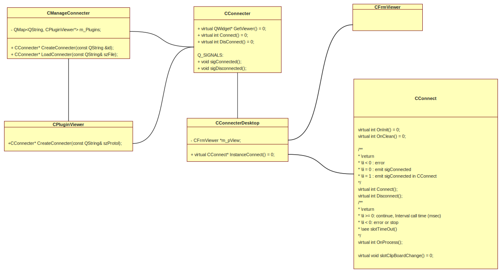
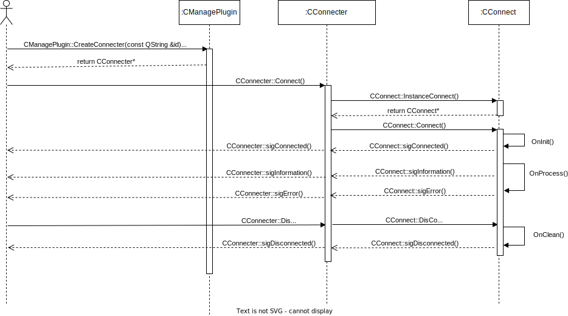

## 玉兔远程控制开发文档

作者：康 林 <kl222@126.com>

### 项目位置

- 项目位置：
  - 主库：[https://github.com/KangLin/RabbitRemoteControl](https://github.com/KangLin/RabbitRemoteControl)
  - 中国镜像：[https://gitee.com/kl222/RabbitRemoteControl](https://gitee.com/kl222/RabbitRemoteControl)

### 版本号说明：

- 版本号说明： [https://semver.org/lang/zh-CN/](https://semver.org/lang/zh-CN/)

### 编译

- [Linux](../Compile/Linux_zh_CN.md)
- [Windows](../Compile/Windows_zh_CN.md)

### 模块

- [模块](modules.html)
- 控制插件 API
  + 类关系图  
    
  + 序列图  
    
